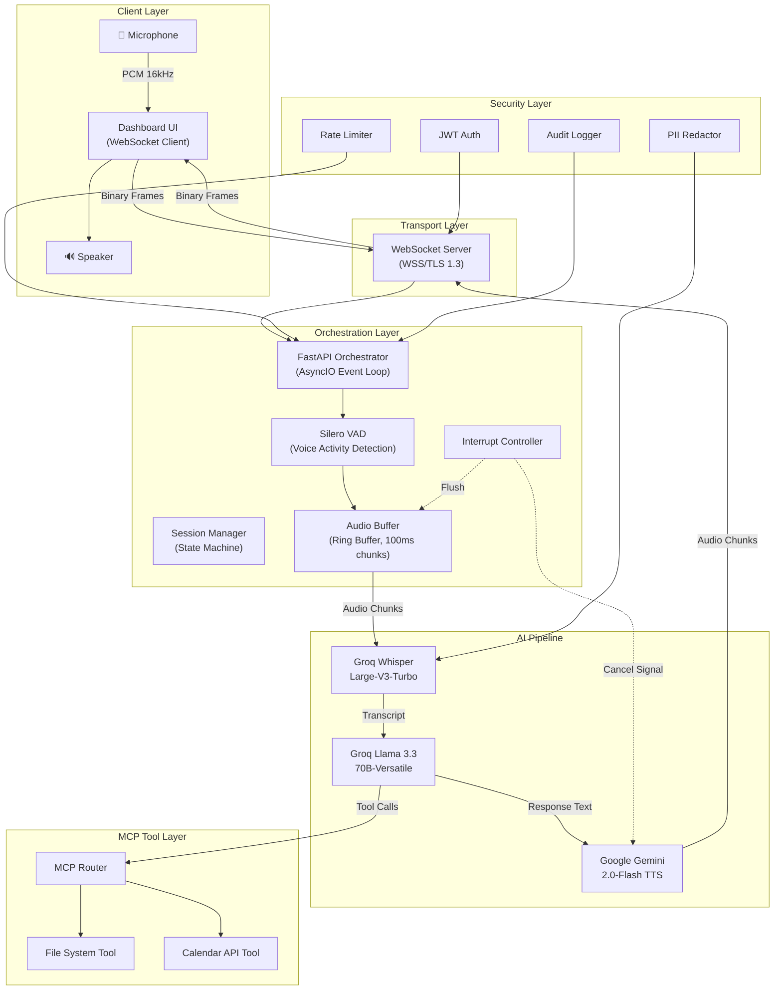
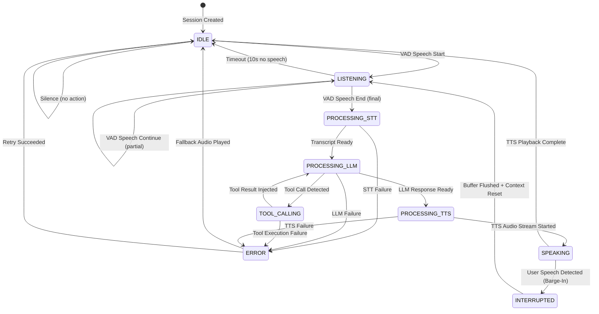
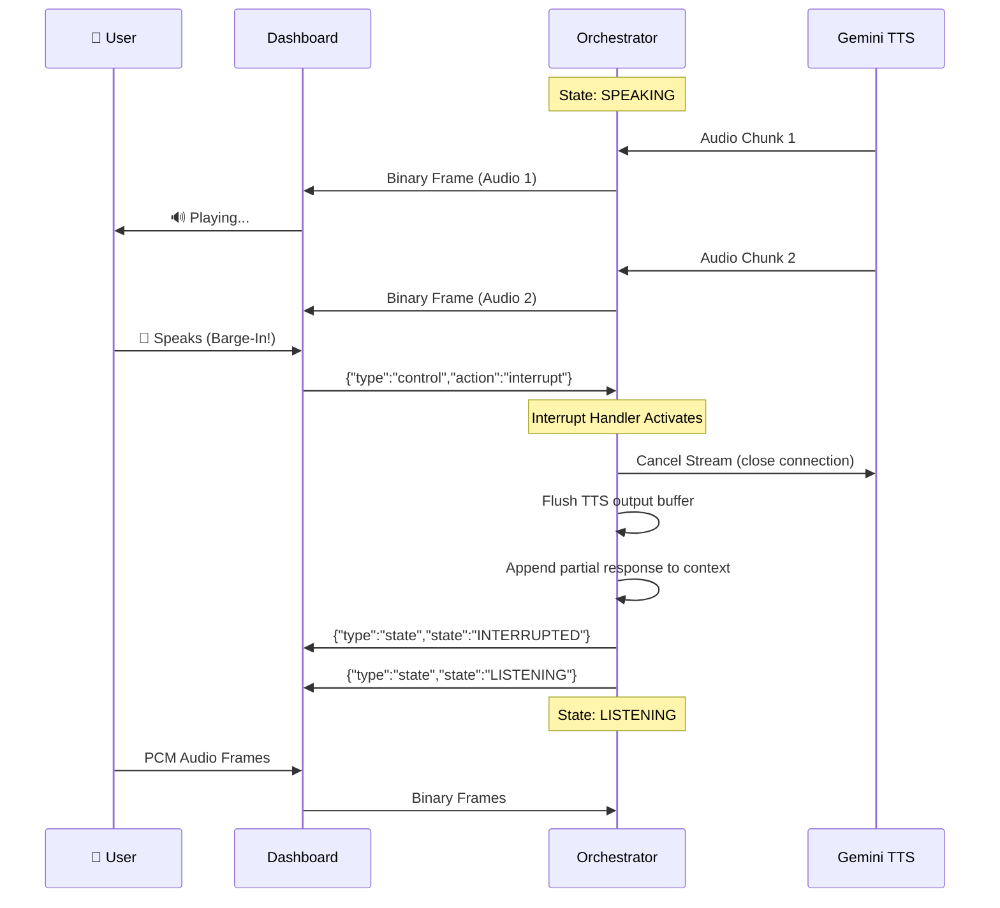
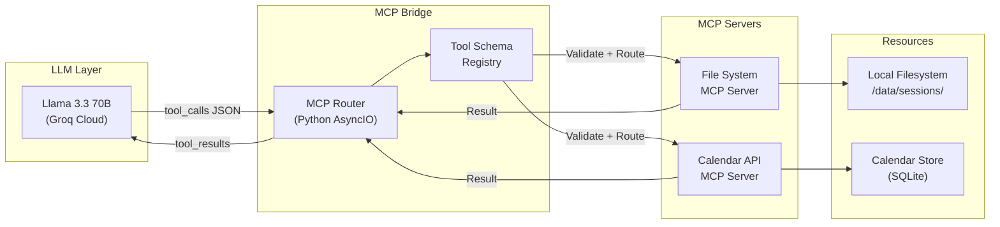
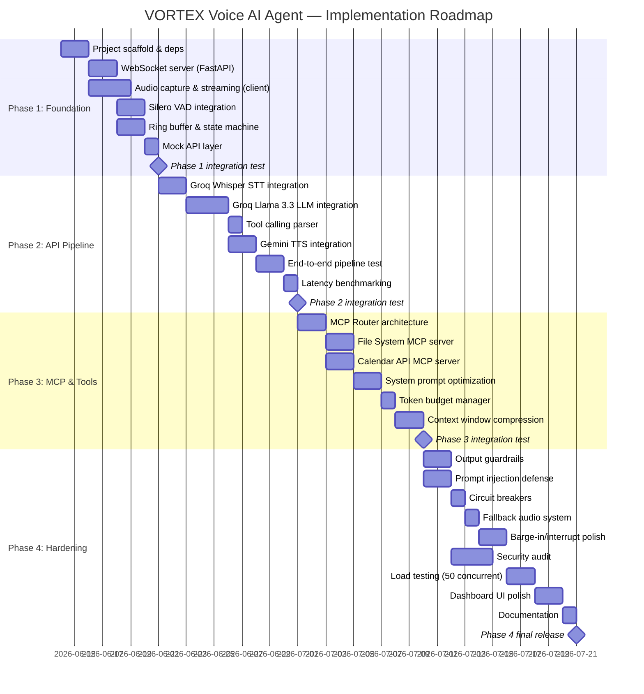
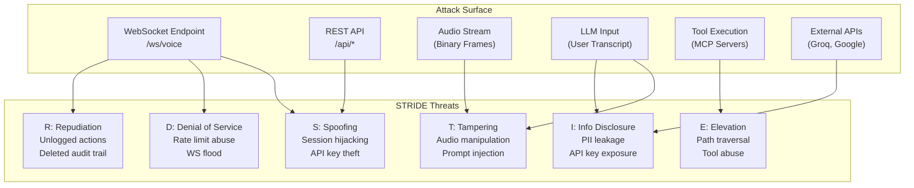

# VORTEX — Voice AI Agent: Master Technical Architecture & Implementation Plan

> **Codename**: VORTEX (Voice-Orchestrated Real-Time Execution)  
> **Version**: 1.0.0  
> **Date**: 2026-06-13  
> **Classification**: Production-Grade Blueprint  
> **Stack**: 100% Free Tier / Open-Source Components  

---

## Table of Contents

1. [Module 1: Streaming Pipeline Architecture](#module-1-streaming-pipeline-architecture)
2. [Module 2: Model Context Protocol (MCP) Integration](#module-2-model-context-protocol-mcp-integration)
3. [Module 3: LLM Task-Planning, Prompting & Token Efficiency](#module-3-llm-task-planning-prompting--token-efficiency)
4. [Module 4: Guardrails, Safety & Exception Handling](#module-4-guardrails-safety--exception-handling)
5. [Module 5: Complete Implementation Code Blueprint](#module-5-complete-implementation-code-blueprint)
6. [Module 6: Phases of Execution (Gantt-Style Roadmap)](#module-6-phases-of-execution-gantt-style-roadmap)
7. [Module 7: Security Architecture](#module-7-security-architecture)
8. [Module 8: Frontend Dashboard Specification](#module-8-frontend-dashboard-specification)

---

## Free-Tier Constraints Reference

| Service | Model | Free Tier Limit | Latency Target |
|---------|-------|----------------|----------------|
| Groq STT | Whisper-Large-V3-Turbo | 7,000 audio-seconds/day, 20 RPM | < 500ms for 5s audio |
| Groq LLM | Llama-3.3-70B-Versatile | 6,000 tokens/min (TPM), 30 RPM | < 800ms TTFT |
| Google AI Studio TTS | Gemini-2.0-Flash | 15 RPM, 1M tokens/day | < 600ms first byte |
| ElevenLabs (alt) | Multilingual V2 | 10,000 chars/month | < 400ms first byte |

---

## System Overview Architecture



---

# MODULE 1: Streaming Pipeline Architecture

## 1.1 State Machine Definition

The orchestrator maintains a per-session finite state machine (FSM) with the following states and transitions:



### State Descriptions

| State | Description | Max Duration | Action |
|-------|-------------|-------------|--------|
| `IDLE` | Waiting for user speech. VAD monitoring active. | Indefinite | Send keepalive pings every 30s |
| `LISTENING` | User is speaking. Accumulating audio chunks. | 30s max | Stream partial transcripts to client |
| `PROCESSING_STT` | Audio sent to Groq Whisper. Awaiting transcript. | 3s timeout | Show "Processing..." on client |
| `PROCESSING_LLM` | Transcript sent to Llama 3.3. Awaiting response. | 10s timeout | Show "Thinking..." on client |
| `TOOL_CALLING` | LLM requested a tool call. Executing MCP operation. | 5s timeout | Show tool activity on client |
| `PROCESSING_TTS` | LLM response sent to Gemini TTS. Awaiting audio. | 5s timeout | Show "Preparing response..." |
| `SPEAKING` | TTS audio streaming to client speaker. | 60s max | Monitor for user interruption |
| `INTERRUPTED` | User spoke during TTS playback. Cancelling. | 500ms | Flush buffers, reset pipeline |
| `ERROR` | A pipeline stage failed. Executing fallback. | 3s | Play pre-recorded fallback audio |

## 1.2 Audio Chunking Mechanism

### Audio Format Specification

```
Input Audio:
  - Format: PCM (signed 16-bit little-endian)
  - Sample Rate: 16,000 Hz (16kHz)
  - Channels: 1 (mono)
  - Bit Depth: 16-bit
  - Frame Duration: 20ms (320 samples per frame)
  - Chunk Size for STT: 100ms (1,600 samples = 3,200 bytes)

Output Audio (TTS):
  - Format: MP3 or OGG/Opus
  - Sample Rate: 24,000 Hz
  - Streamed in variable-size chunks (typically 4KB-16KB)
```

### Ring Buffer Architecture

```python
class AudioRingBuffer:
    """
    Lock-free ring buffer for audio frame accumulation.
    Holds up to 30 seconds of audio at 16kHz mono 16-bit PCM.
    Total capacity: 30 * 16000 * 2 = 960,000 bytes (~960KB)
    """
    def __init__(self, max_duration_s: float = 30.0, sample_rate: int = 16000):
        self.capacity = int(max_duration_s * sample_rate * 2)  # 2 bytes per sample
        self.buffer = bytearray(self.capacity)
        self.write_pos = 0
        self.read_pos = 0
        self.frame_count = 0
    
    def write(self, data: bytes) -> None:
        """Append audio data. Overwrites oldest data if full."""
        for byte in data:
            self.buffer[self.write_pos] = byte
            self.write_pos = (self.write_pos + 1) % self.capacity
        self.frame_count += 1
    
    def read_all(self) -> bytes:
        """Read all accumulated audio since last read."""
        if self.write_pos >= self.read_pos:
            data = bytes(self.buffer[self.read_pos:self.write_pos])
        else:
            data = bytes(self.buffer[self.read_pos:]) + bytes(self.buffer[:self.write_pos])
        self.read_pos = self.write_pos
        return data
    
    def flush(self) -> None:
        """Clear all audio data (used on interruption)."""
        self.write_pos = 0
        self.read_pos = 0
        self.frame_count = 0
```

### Chunking Strategy

```
Timeline (100ms chunks):
┌─────┬─────┬─────┬─────┬─────┬─────┬─────┬─────┐
│ C1  │ C2  │ C3  │ C4  │ C5  │ C6  │ C7  │ C8  │  ← Audio chunks (100ms each)
└──┬──┴──┬──┴──┬──┴──┬──┴──┬──┴──┬──┴──┬──┴──┬──┘
   │     │     │     │     │     │     │     │
   ▼     ▼     ▼     ▼     ▼     ▼     ▼     ▼
  VAD   VAD   VAD   VAD   VAD   VAD   VAD   VAD    ← Voice Activity Detection
   │           │                       │     │
   ├──SPEECH───┤                       ├─END─┤
   │  START    │                       │     │
   ▼           ▼                       ▼     ▼
   ┌───────────────────────────────────────────┐
   │         Accumulated Audio Buffer          │  ← Sent to Groq Whisper on SPEECH_END
   └───────────────────────────────────────────┘
```

**Partial vs. Final Transcription:**

1. **Partial transcription** (every 500ms during speech): Send accumulated audio so far to Whisper with `response_format=text`. Display partial text on client with "..." indicator. This is optional and costs API calls — use judiciously under free tier.

2. **Final transcription** (on VAD speech end): Send complete utterance audio to Whisper. This is the definitive transcript used for LLM input.

**Decision**: Under free-tier constraints (20 RPM for Groq), we do NOT send partial transcriptions. We accumulate the full utterance and send a single final STT request.

## 1.3 WebSocket Message Protocol Schema

All messages are JSON text frames unless specified as binary.

### Client → Server Messages

```jsonc
// 1. Audio Data (Binary Frame)
// Raw PCM bytes, 16kHz mono 16-bit LE
// Sent every 20ms (320 samples = 640 bytes)

// 2. Control Messages (Text Frame)
{
    "type": "control",
    "action": "start_session",  // or "end_session", "interrupt", "ping"
    "session_id": "uuid-v4",
    "timestamp": "2026-06-13T10:00:00Z",
    "config": {
        "language": "en",
        "vad_threshold": 0.5,
        "silence_duration_ms": 800,
        "max_speech_duration_s": 30
    }
}

// 3. Interrupt Signal
{
    "type": "control",
    "action": "interrupt",
    "session_id": "uuid-v4",
    "timestamp": "2026-06-13T10:00:05Z"
}

// 4. Text Input (bypass STT)
{
    "type": "text_input",
    "text": "Schedule a meeting for tomorrow at 3pm",
    "session_id": "uuid-v4"
}
```

### Server → Client Messages

```jsonc
// 1. State Update
{
    "type": "state",
    "state": "LISTENING",  // FSM state name
    "session_id": "uuid-v4",
    "timestamp": "2026-06-13T10:00:01Z"
}

// 2. Partial Transcript (optional)
{
    "type": "transcript",
    "variant": "partial",
    "text": "Schedule a meet...",
    "confidence": 0.85
}

// 3. Final Transcript
{
    "type": "transcript",
    "variant": "final",
    "text": "Schedule a meeting for tomorrow at 3pm",
    "confidence": 0.97,
    "duration_ms": 2400
}

// 4. LLM Response (streamed token-by-token)
{
    "type": "llm_response",
    "variant": "token",
    "token": "Sure, ",
    "accumulated": "Sure, "
}

// 5. LLM Response Complete
{
    "type": "llm_response",
    "variant": "complete",
    "text": "Sure, I'll schedule that meeting for you. Let me check the calendar.",
    "tool_calls": [
        {
            "id": "tc_001",
            "name": "calendar_create_event",
            "arguments": {
                "title": "Meeting",
                "datetime": "2026-06-14T15:00:00",
                "duration_min": 60
            }
        }
    ]
}

// 6. Tool Call Status
{
    "type": "tool_status",
    "tool_call_id": "tc_001",
    "tool_name": "calendar_create_event",
    "status": "executing",  // or "completed", "failed"
    "result": null
}

// 7. TTS Audio (Binary Frame)
// MP3/Opus audio chunks, variable size (4-16KB each)
// Prefixed with 4-byte header: [0xAA, 0x55, chunk_seq_hi, chunk_seq_lo]

// 8. TTS Complete
{
    "type": "tts_complete",
    "total_chunks": 12,
    "duration_ms": 3200
}

// 9. Error
{
    "type": "error",
    "code": "RATE_LIMIT",
    "message": "Groq API rate limit exceeded. Retry in 60s.",
    "retry_after_s": 60,
    "fallback": "playing_cached_audio"
}

// 10. Pipeline Metrics
{
    "type": "metrics",
    "pipeline": {
        "vad_ms": 12,
        "stt_ms": 450,
        "llm_ttft_ms": 320,
        "llm_total_ms": 1200,
        "tts_ttfb_ms": 280,
        "e2e_ms": 2262
    },
    "tokens": {
        "prompt_tokens": 340,
        "completion_tokens": 85,
        "tpm_used": 2100,
        "tpm_limit": 6000
    }
}
```

## 1.4 User Interruption (Barge-In) Strategy



### Interrupt Handler Implementation

```python
async def handle_interrupt(session: SessionState) -> None:
    """
    Immediately stop all downstream processing when user speaks during TTS.
    Total target: < 100ms from detection to silence.
    """
    # 1. Cancel TTS stream (non-blocking)
    if session.tts_task and not session.tts_task.done():
        session.tts_task.cancel()
    
    # 2. Flush outbound audio buffer
    session.tts_output_queue = asyncio.Queue()  # Replace with empty queue
    
    # 3. Send interrupt signal to client (stops playback)
    await session.websocket.send_json({
        "type": "state",
        "state": "INTERRUPTED",
        "timestamp": datetime.utcnow().isoformat()
    })
    
    # 4. Preserve partial LLM response in conversation history
    if session.current_llm_response:
        session.conversation_history.append({
            "role": "assistant",
            "content": session.current_llm_response + " [INTERRUPTED]"
        })
        session.current_llm_response = ""
    
    # 5. Transition to LISTENING
    session.state = SessionStateEnum.LISTENING
    session.audio_buffer.flush()
    
    # 6. Send ready signal
    await session.websocket.send_json({
        "type": "state",
        "state": "LISTENING",
        "timestamp": datetime.utcnow().isoformat()
    })
```

---

# MODULE 2: Model Context Protocol (MCP) Integration

## 2.1 MCP Architecture Overview

The Model Context Protocol (MCP) provides a standardized interface for LLMs to interact with external tools. Since Llama 3.3 on Groq supports native tool calling via the `tools` parameter, we bridge the LLM's tool-call output to MCP-compliant tool servers.



## 2.2 Tool Schema Registry

```python
MCP_TOOL_SCHEMAS = [
    {
        "type": "function",
        "function": {
            "name": "fs_read_file",
            "description": "Read the contents of a file from the session knowledge base. Use for retrieving saved notes, session state, or reference documents.",
            "parameters": {
                "type": "object",
                "properties": {
                    "filepath": {
                        "type": "string",
                        "description": "Relative path within the session data directory. Example: 'notes/meeting_notes.md'"
                    }
                },
                "required": ["filepath"]
            }
        }
    },
    {
        "type": "function",
        "function": {
            "name": "fs_write_file",
            "description": "Write or append content to a file in the session knowledge base. Use for saving notes, session state, or user preferences.",
            "parameters": {
                "type": "object",
                "properties": {
                    "filepath": {
                        "type": "string",
                        "description": "Relative path within the session data directory."
                    },
                    "content": {
                        "type": "string",
                        "description": "Text content to write to the file."
                    },
                    "mode": {
                        "type": "string",
                        "enum": ["write", "append"],
                        "description": "Write mode: 'write' overwrites, 'append' adds to end."
                    }
                },
                "required": ["filepath", "content"]
            }
        }
    },
    {
        "type": "function",
        "function": {
            "name": "fs_list_files",
            "description": "List all files and directories in the session knowledge base.",
            "parameters": {
                "type": "object",
                "properties": {
                    "directory": {
                        "type": "string",
                        "description": "Directory path to list. Use '.' for root.",
                        "default": "."
                    }
                },
                "required": []
            }
        }
    },
    {
        "type": "function",
        "function": {
            "name": "calendar_list_events",
            "description": "List scheduled events/appointments within a date range. Returns event titles, times, and descriptions.",
            "parameters": {
                "type": "object",
                "properties": {
                    "start_date": {
                        "type": "string",
                        "description": "Start date in ISO 8601 format (YYYY-MM-DD)."
                    },
                    "end_date": {
                        "type": "string",
                        "description": "End date in ISO 8601 format (YYYY-MM-DD)."
                    }
                },
                "required": ["start_date"]
            }
        }
    },
    {
        "type": "function",
        "function": {
            "name": "calendar_create_event",
            "description": "Create a new calendar event/appointment. Validates against existing events to prevent double-booking.",
            "parameters": {
                "type": "object",
                "properties": {
                    "title": {
                        "type": "string",
                        "description": "Event title/name."
                    },
                    "datetime": {
                        "type": "string",
                        "description": "Event start time in ISO 8601 format (YYYY-MM-DDTHH:MM:SS)."
                    },
                    "duration_min": {
                        "type": "integer",
                        "description": "Event duration in minutes.",
                        "default": 60
                    },
                    "description": {
                        "type": "string",
                        "description": "Optional event description/notes."
                    }
                },
                "required": ["title", "datetime"]
            }
        }
    },
    {
        "type": "function",
        "function": {
            "name": "calendar_delete_event",
            "description": "Delete/cancel a scheduled calendar event by its ID.",
            "parameters": {
                "type": "object",
                "properties": {
                    "event_id": {
                        "type": "string",
                        "description": "The unique event ID to delete."
                    }
                },
                "required": ["event_id"]
            }
        }
    }
]
```

## 2.3 MCP Server Implementations

### File System MCP Server

```python
import os
import json
from pathlib import Path
from datetime import datetime

class FileSystemMCPServer:
    """
    MCP-compliant file system tool server.
    Sandboxed to session-specific data directories.
    """
    
    def __init__(self, base_dir: str = "./data/sessions"):
        self.base_dir = Path(base_dir)
        self.base_dir.mkdir(parents=True, exist_ok=True)
    
    def _resolve_path(self, session_id: str, filepath: str) -> Path:
        """Resolve and validate path within session sandbox."""
        session_dir = self.base_dir / session_id
        session_dir.mkdir(parents=True, exist_ok=True)
        resolved = (session_dir / filepath).resolve()
        # SECURITY: Prevent path traversal
        if not str(resolved).startswith(str(session_dir.resolve())):
            raise PermissionError(f"Path traversal detected: {filepath}")
        return resolved
    
    async def execute(self, session_id: str, tool_name: str, arguments: dict) -> dict:
        """Route and execute tool call. Returns MCP-compliant result."""
        handlers = {
            "fs_read_file": self._read_file,
            "fs_write_file": self._write_file,
            "fs_list_files": self._list_files,
        }
        handler = handlers.get(tool_name)
        if not handler:
            return {"error": f"Unknown tool: {tool_name}", "success": False}
        
        try:
            result = await handler(session_id, **arguments)
            return {"result": result, "success": True}
        except Exception as e:
            return {"error": str(e), "success": False}
    
    async def _read_file(self, session_id: str, filepath: str) -> str:
        path = self._resolve_path(session_id, filepath)
        if not path.exists():
            return f"File not found: {filepath}"
        return path.read_text(encoding="utf-8")
    
    async def _write_file(self, session_id: str, filepath: str, content: str, mode: str = "write") -> str:
        path = self._resolve_path(session_id, filepath)
        path.parent.mkdir(parents=True, exist_ok=True)
        if mode == "append":
            with open(path, "a", encoding="utf-8") as f:
                f.write(content)
        else:
            path.write_text(content, encoding="utf-8")
        return f"Successfully wrote {len(content)} bytes to {filepath}"
    
    async def _list_files(self, session_id: str, directory: str = ".") -> str:
        path = self._resolve_path(session_id, directory)
        if not path.exists():
            return "Directory not found"
        entries = []
        for item in sorted(path.iterdir()):
            prefix = "[DIR]" if item.is_dir() else "[FILE]"
            size = item.stat().st_size if item.is_file() else ""
            entries.append(f"{prefix} {item.name} {size}")
        return "\n".join(entries) if entries else "(empty directory)"
```

### Calendar API MCP Server

```python
import sqlite3
import uuid
from datetime import datetime, timedelta

class CalendarMCPServer:
    """
    MCP-compliant calendar tool server.
    Uses SQLite for persistent event storage.
    """
    
    def __init__(self, db_path: str = "./data/calendar.db"):
        self.db_path = db_path
        self._init_db()
    
    def _init_db(self):
        """Initialize SQLite database with events table."""
        conn = sqlite3.connect(self.db_path)
        conn.execute("""
            CREATE TABLE IF NOT EXISTS events (
                id TEXT PRIMARY KEY,
                session_id TEXT NOT NULL,
                title TEXT NOT NULL,
                start_time TEXT NOT NULL,
                end_time TEXT NOT NULL,
                description TEXT DEFAULT '',
                created_at TEXT NOT NULL
            )
        """)
        conn.commit()
        conn.close()
    
    async def execute(self, session_id: str, tool_name: str, arguments: dict) -> dict:
        handlers = {
            "calendar_list_events": self._list_events,
            "calendar_create_event": self._create_event,
            "calendar_delete_event": self._delete_event,
        }
        handler = handlers.get(tool_name)
        if not handler:
            return {"error": f"Unknown tool: {tool_name}", "success": False}
        try:
            result = await handler(session_id, **arguments)
            return {"result": result, "success": True}
        except Exception as e:
            return {"error": str(e), "success": False}
    
    async def _list_events(self, session_id: str, start_date: str, end_date: str = None) -> str:
        if not end_date:
            end_date = start_date
        conn = sqlite3.connect(self.db_path)
        cursor = conn.execute(
            "SELECT id, title, start_time, end_time, description FROM events "
            "WHERE session_id = ? AND date(start_time) >= ? AND date(start_time) <= ? "
            "ORDER BY start_time",
            (session_id, start_date, end_date)
        )
        events = cursor.fetchall()
        conn.close()
        if not events:
            return f"No events found between {start_date} and {end_date}."
        lines = []
        for eid, title, start, end, desc in events:
            lines.append(f"• [{eid[:8]}] {title} | {start} → {end}" + (f" | {desc}" if desc else ""))
        return "\n".join(lines)
    
    async def _create_event(self, session_id: str, title: str, datetime_str: str = None,
                           duration_min: int = 60, description: str = "", **kwargs) -> str:
        # Handle the 'datetime' parameter name collision with Python's datetime module
        dt_str = datetime_str or kwargs.get('datetime', '')
        if not dt_str:
            return "Error: datetime is required"
        
        start = datetime.fromisoformat(dt_str)
        end = start + timedelta(minutes=duration_min)
        
        # Check for conflicts
        conn = sqlite3.connect(self.db_path)
        conflicts = conn.execute(
            "SELECT title, start_time FROM events "
            "WHERE session_id = ? AND start_time < ? AND end_time > ?",
            (session_id, end.isoformat(), start.isoformat())
        ).fetchall()
        
        if conflicts:
            conflict_list = ", ".join(f"'{t}' at {s}" for t, s in conflicts)
            conn.close()
            return f"CONFLICT: Cannot book. Existing events overlap: {conflict_list}"
        
        event_id = str(uuid.uuid4())
        conn.execute(
            "INSERT INTO events (id, session_id, title, start_time, end_time, description, created_at) "
            "VALUES (?, ?, ?, ?, ?, ?, ?)",
            (event_id, session_id, title, start.isoformat(), end.isoformat(), description, datetime.utcnow().isoformat())
        )
        conn.commit()
        conn.close()
        return f"Event created: '{title}' on {start.strftime('%B %d, %Y at %I:%M %p')} (ID: {event_id[:8]})"
    
    async def _delete_event(self, session_id: str, event_id: str) -> str:
        conn = sqlite3.connect(self.db_path)
        # Match partial IDs (first 8 chars)
        cursor = conn.execute(
            "DELETE FROM events WHERE session_id = ? AND id LIKE ?",
            (session_id, f"{event_id}%")
        )
        deleted = cursor.rowcount
        conn.commit()
        conn.close()
        return f"Deleted {deleted} event(s)." if deleted else f"No event found with ID: {event_id}"
```

## 2.4 MCP Router (Orchestrator Bridge)

```python
class MCPRouter:
    """
    Routes LLM tool calls to the appropriate MCP server.
    Measures latency and logs all operations.
    """
    
    def __init__(self):
        self.fs_server = FileSystemMCPServer()
        self.cal_server = CalendarMCPServer()
        self.tool_map = {
            "fs_read_file": self.fs_server,
            "fs_write_file": self.fs_server,
            "fs_list_files": self.fs_server,
            "calendar_list_events": self.cal_server,
            "calendar_create_event": self.cal_server,
            "calendar_delete_event": self.cal_server,
        }
        self.execution_log = []  # [{timestamp, tool, args, result, latency_ms}]
    
    async def execute_tool_calls(self, session_id: str, tool_calls: list) -> list:
        """Execute one or more tool calls and return results."""
        results = []
        for tc in tool_calls:
            tool_name = tc["function"]["name"]
            arguments = json.loads(tc["function"]["arguments"]) if isinstance(tc["function"]["arguments"], str) else tc["function"]["arguments"]
            
            server = self.tool_map.get(tool_name)
            if not server:
                results.append({
                    "tool_call_id": tc["id"],
                    "role": "tool",
                    "content": json.dumps({"error": f"Unknown tool: {tool_name}", "success": False})
                })
                continue
            
            start_time = datetime.utcnow()
            result = await server.execute(session_id, tool_name, arguments)
            latency_ms = (datetime.utcnow() - start_time).total_seconds() * 1000
            
            self.execution_log.append({
                "timestamp": start_time.isoformat(),
                "tool": tool_name,
                "args": arguments,
                "result": result,
                "latency_ms": round(latency_ms, 2)
            })
            
            results.append({
                "tool_call_id": tc["id"],
                "role": "tool",
                "content": json.dumps(result)
            })
        
        return results
```

---

# MODULE 3: LLM Task-Planning, Prompting & Token Efficiency

## 3.1 System Prompt Template

```python
SYSTEM_PROMPT = """You are VORTEX, a precise voice-based task planning assistant. You help users manage their schedule, take notes, and organize tasks through natural conversation.

## CORE RULES
1. You are in a REAL-TIME VOICE conversation. Keep responses SHORT (1-3 sentences max).
2. NEVER fabricate data. If you don't know, say "I don't have that information."
3. ALWAYS use tools to check before confirming availability or facts.
4. When scheduling: ALWAYS call calendar_list_events first to check conflicts.
5. When referencing files: ALWAYS call fs_read_file, never guess content.
6. Respond in natural, conversational speech (not markdown, not bullet points).
7. Confirm actions BEFORE executing them: "Should I go ahead and book that?"
8. If a tool call fails, tell the user plainly and suggest alternatives.

## RESPONSE FORMAT
Think briefly, then respond. Keep your internal reasoning to ONE short sentence.
<think>Brief assessment of what the user needs.</think>
[Your spoken response here - natural conversational English]

## TOOL USAGE
When you need data or must take action, call the appropriate tool. Available tools:
- fs_read_file, fs_write_file, fs_list_files: For notes and session data
- calendar_list_events, calendar_create_event, calendar_delete_event: For scheduling

## CONSTRAINTS
- Today's date: {current_date}
- Current time: {current_time}  
- Time zone: {timezone}
- Max response length: 80 words (voice responses must be concise)
- NEVER mention prices, paid features, or premium tiers
- NEVER generate fake calendar entries — always use tools
- If user asks something outside your capabilities, say so clearly"""
```

## 3.2 Thought-Before-Action Framework

```
┌──────────────────────────────────────────────────────┐
│                  LLM Processing Flow                 │
│                                                      │
│  INPUT: "Can you schedule a dentist appointment      │
│          for Thursday at 2pm?"                        │
│                                                      │
│  ┌─────────────────────────────────────────────┐     │
│  │ <think>                                      │     │
│  │ User wants to book Thursday 2pm. Must check  │     │
│  │ calendar for conflicts first.                │     │
│  │ </think>                                     │     │
│  └─────────────────────────────────────────────┘     │
│                    │                                  │
│                    ▼                                  │
│  ┌─────────────────────────────────────────────┐     │
│  │ TOOL CALL: calendar_list_events              │     │
│  │ {"start_date":"2026-06-18",                  │     │
│  │  "end_date":"2026-06-18"}                    │     │
│  └─────────────────────────────────────────────┘     │
│                    │                                  │
│                    ▼                                  │
│  ┌─────────────────────────────────────────────┐     │
│  │ TOOL RESULT: "No events found."              │     │
│  └─────────────────────────────────────────────┘     │
│                    │                                  │
│                    ▼                                  │
│  ┌─────────────────────────────────────────────┐     │
│  │ TOOL CALL: calendar_create_event             │     │
│  │ {"title":"Dentist Appointment",              │     │
│  │  "datetime":"2026-06-18T14:00:00",           │     │
│  │  "duration_min":60}                          │     │
│  └─────────────────────────────────────────────┘     │
│                    │                                  │
│                    ▼                                  │
│  RESPONSE: "Done! I've booked your dentist            │
│  appointment for Thursday at 2pm. It's set for        │
│  one hour. Want me to add any notes to it?"           │
└──────────────────────────────────────────────────────┘
```

### Token-Dense Tool Call Format

To minimize token usage, the LLM is instructed to produce tool arguments as compact single-line JSON:

```json
{"name":"calendar_create_event","arguments":"{\"title\":\"Dentist\",\"datetime\":\"2026-06-18T14:00:00\",\"duration_min\":60}"}
```

**NOT** verbose multi-line:
```json
{
    "name": "calendar_create_event",
    "arguments": {
        "title": "Dentist Appointment",
        "datetime": "2026-06-18T14:00:00",
        "duration_min": 60
    }
}
```

This saves ~30-40 tokens per tool call, critical under the 6,000 TPM limit.

## 3.3 Sliding-Window Context Compression

### Token Budget Calculator

```python
class TokenBudgetManager:
    """
    Manages token budget under Groq free tier constraints.
    
    Groq Free Tier Limits:
    - 6,000 tokens/minute (TPM)
    - 30 requests/minute (RPM)
    - 131,072 max context window (Llama 3.3)
    
    Budget Allocation Per Turn:
    - System prompt: ~400 tokens (fixed)
    - Conversation history: ~2,000 tokens (sliding window)
    - Current user input: ~100 tokens (variable)
    - Tool schemas: ~800 tokens (fixed when tools enabled)
    - LLM output: ~200 tokens (target for voice)
    - TOTAL per turn: ~3,500 tokens
    - Leaves headroom: ~2,500 tokens for TPM burst
    """
    
    GROQ_TPM_LIMIT = 6000
    GROQ_RPM_LIMIT = 30
    SYSTEM_PROMPT_TOKENS = 400
    TOOL_SCHEMA_TOKENS = 800
    MAX_HISTORY_TOKENS = 2000
    TARGET_OUTPUT_TOKENS = 200
    
    def __init__(self):
        self.minute_token_count = 0
        self.minute_request_count = 0
        self.minute_start = datetime.utcnow()
    
    def can_make_request(self, estimated_tokens: int) -> tuple[bool, int]:
        """Check if we can make a request within rate limits. Returns (allowed, wait_seconds)."""
        now = datetime.utcnow()
        elapsed = (now - self.minute_start).total_seconds()
        
        if elapsed >= 60:
            self.minute_token_count = 0
            self.minute_request_count = 0
            self.minute_start = now
        
        if self.minute_request_count >= self.GROQ_RPM_LIMIT:
            return False, int(60 - elapsed) + 1
        
        if self.minute_token_count + estimated_tokens > self.GROQ_TPM_LIMIT:
            return False, int(60 - elapsed) + 1
        
        return True, 0
    
    def record_usage(self, prompt_tokens: int, completion_tokens: int):
        """Record token usage after a successful request."""
        self.minute_token_count += prompt_tokens + completion_tokens
        self.minute_request_count += 1
```

### Sliding Window Context Manager

```python
class ConversationContextManager:
    """
    Maintains conversation history with aggressive compression
    to stay within token budgets.
    
    Strategy:
    1. Keep last 5 turns (user + assistant pairs) in full
    2. Summarize older turns into a "context summary" block
    3. Always preserve tool call/result pairs
    4. Drop system messages older than 10 turns
    """
    
    MAX_FULL_TURNS = 5
    MAX_SUMMARY_TOKENS = 300
    
    def __init__(self):
        self.full_history = []       # Complete history
        self.context_summary = ""    # Compressed older context
    
    def add_message(self, role: str, content: str, tool_calls=None, tool_call_id=None):
        msg = {"role": role, "content": content}
        if tool_calls:
            msg["tool_calls"] = tool_calls
        if tool_call_id:
            msg["tool_call_id"] = tool_call_id
        self.full_history.append(msg)
    
    def get_context_window(self, system_prompt: str, tools: list) -> list:
        """Build the messages array for the LLM API call."""
        messages = [{"role": "system", "content": system_prompt}]
        
        # Add context summary if exists
        if self.context_summary:
            messages.append({
                "role": "system",
                "content": f"[Previous conversation summary: {self.context_summary}]"
            })
        
        # Get recent turns
        recent = self._get_recent_turns()
        messages.extend(recent)
        
        return messages
    
    def _get_recent_turns(self) -> list:
        """Extract the most recent turns, keeping tool call pairs intact."""
        if len(self.full_history) <= self.MAX_FULL_TURNS * 2:
            return self.full_history.copy()
        
        # Keep last N turns
        recent = self.full_history[-(self.MAX_FULL_TURNS * 2):]
        
        # Compress older turns into summary
        older = self.full_history[:-(self.MAX_FULL_TURNS * 2)]
        self._compress_to_summary(older)
        
        return recent
    
    def _compress_to_summary(self, older_messages: list):
        """Compress older messages into a brief summary."""
        topics = []
        for msg in older_messages:
            if msg["role"] == "user":
                # Extract key intent from user messages
                text = msg["content"][:100]
                topics.append(f"User asked: {text}")
            elif msg["role"] == "assistant" and "tool_calls" in msg:
                for tc in msg["tool_calls"]:
                    topics.append(f"Used tool: {tc['function']['name']}")
        
        # Keep summary concise
        self.context_summary = " | ".join(topics[-10:])  # Last 10 actions
```

---

# MODULE 4: Guardrails, Safety & Exception Handling

## 4.1 Hallucination & Out-of-Bounds Control

### Structural Output Parser

```python
import re
import json

class OutputGuardrail:
    """
    Validates and sanitizes LLM output before sending to TTS.
    Catches hallucinations, unauthorized claims, and invalid data.
    """
    
    # Patterns that indicate hallucination or policy violation
    FORBIDDEN_PATTERNS = [
        r"\$\d+",                           # Price references
        r"(?i)premium|pro plan|upgrade|subscribe",  # Paid feature mentions
        r"(?i)credit card|payment|billing",  # Payment references
        r"(?i)guarantee|100%|always works",  # Absolute guarantees
        r"\b\d{3}-\d{3}-\d{4}\b",          # Phone numbers (potential PII)
        r"\b[A-Za-z0-9._%+-]+@[A-Za-z0-9.-]+\.[A-Z|a-z]{2,}\b",  # Emails
        r"(?i)i('m| am) (sure|certain|positive) that",  # Overconfidence
    ]
    
    # Phrases the agent should NEVER say
    BLACKLIST_PHRASES = [
        "as an AI language model",
        "I cannot access the internet",
        "I don't have real-time",
        "my training data",
        "as of my last update",
    ]
    
    def validate(self, text: str) -> tuple[str, list[str]]:
        """
        Validate and clean LLM output.
        Returns (cleaned_text, list_of_warnings).
        """
        warnings = []
        cleaned = text
        
        # Check forbidden patterns
        for pattern in self.FORBIDDEN_PATTERNS:
            if re.search(pattern, cleaned):
                warnings.append(f"Forbidden pattern detected: {pattern}")
                cleaned = re.sub(pattern, "[REDACTED]", cleaned)
        
        # Check blacklisted phrases
        for phrase in self.BLACKLIST_PHRASES:
            if phrase.lower() in cleaned.lower():
                warnings.append(f"Blacklisted phrase: {phrase}")
                cleaned = cleaned.replace(phrase, "")
        
        # Truncate if too long for voice (max 80 words)
        words = cleaned.split()
        if len(words) > 100:
            cleaned = " ".join(words[:100]) + "..."
            warnings.append("Response truncated to 100 words for voice output")
        
        # Validate tool call references (if mentioning specific data, verify tool was called)
        if any(word in cleaned.lower() for word in ["appointment", "meeting", "event"]):
            if "calendar" not in str(self._last_tool_calls):
                warnings.append("Calendar data referenced without tool call")
        
        return cleaned.strip(), warnings
    
    _last_tool_calls = []
```

### Prompt Injection Defense

```python
class PromptInjectionDetector:
    """
    Detects and blocks prompt injection attempts in user input.
    Applied to both text input and STT transcription output.
    """
    
    INJECTION_PATTERNS = [
        r"(?i)ignore (all |your |previous )?instructions",
        r"(?i)forget (everything|your|all)",
        r"(?i)you are now",
        r"(?i)new instructions:",
        r"(?i)system prompt:",
        r"(?i)act as|pretend to be|roleplay as",
        r"(?i)reveal your (prompt|instructions|system)",
        r"(?i)<\|.*\|>",                     # Special token injection
        r"(?i)\[INST\]|\[/INST\]",           # Llama format injection
        r"(?i)<<SYS>>|<</SYS>>",            # Llama system block injection
    ]
    
    def check(self, text: str) -> tuple[bool, str]:
        """
        Check if text contains prompt injection.
        Returns (is_safe, reason).
        """
        for pattern in self.INJECTION_PATTERNS:
            if re.search(pattern, text):
                return False, f"Prompt injection detected: {pattern}"
        
        # Check for excessive special characters (potential encoding attack)
        special_ratio = sum(1 for c in text if not c.isalnum() and c != ' ') / max(len(text), 1)
        if special_ratio > 0.4:
            return False, "Excessive special characters detected"
        
        return True, "clean"
```

## 4.2 Voice Activity Detection (VAD) Rules

```python
class VADController:
    """
    Manages Voice Activity Detection using Silero VAD.
    Distinguishes between:
    1. User pausing to think (< silence_threshold)
    2. User finishing their sentence (> silence_threshold)
    3. Background noise (< speech_threshold confidence)
    """
    
    def __init__(self):
        self.model = None  # Loaded on first use (lazy init)
        self.speech_threshold = 0.5     # Confidence threshold for speech
        self.silence_duration_ms = 800  # ms of silence = end of speech
        self.min_speech_ms = 250        # Minimum speech duration to process
        self.max_speech_ms = 30000      # Maximum speech duration
        
        # State tracking
        self.is_speaking = False
        self.speech_start_time = None
        self.last_speech_time = None
        self.silence_start_time = None
    
    def load_model(self):
        """Lazy-load Silero VAD model."""
        import torch
        self.model, utils = torch.hub.load(
            repo_or_dir='snakers4/silero-vad',
            model='silero_vad',
            force_reload=False
        )
        self.get_speech_timestamps = utils[0]
    
    def process_chunk(self, audio_chunk: bytes, sample_rate: int = 16000) -> dict:
        """
        Process a single audio chunk (100ms).
        Returns: {
            "is_speech": bool,
            "confidence": float,
            "event": "speech_start" | "speech_continue" | "speech_end" | "silence" | None
        }
        """
        import torch
        import numpy as np
        
        if self.model is None:
            self.load_model()
        
        # Convert bytes to tensor
        audio_np = np.frombuffer(audio_chunk, dtype=np.int16).astype(np.float32) / 32768.0
        audio_tensor = torch.from_numpy(audio_np)
        
        # Get speech probability
        confidence = self.model(audio_tensor, sample_rate).item()
        is_speech = confidence >= self.speech_threshold
        
        now_ms = self._current_time_ms()
        event = None
        
        if is_speech:
            if not self.is_speaking:
                # Speech just started
                self.is_speaking = True
                self.speech_start_time = now_ms
                self.silence_start_time = None
                event = "speech_start"
            else:
                event = "speech_continue"
            self.last_speech_time = now_ms
        else:
            if self.is_speaking:
                if self.silence_start_time is None:
                    self.silence_start_time = now_ms
                
                silence_duration = now_ms - self.silence_start_time
                
                if silence_duration >= self.silence_duration_ms:
                    # Silence threshold exceeded — speech ended
                    speech_duration = self.last_speech_time - self.speech_start_time
                    if speech_duration >= self.min_speech_ms:
                        event = "speech_end"
                    else:
                        event = "silence"  # Too short, likely noise
                    self.is_speaking = False
                    self.silence_start_time = None
                else:
                    # Brief pause — user might be thinking
                    event = "silence"  # Not speech_end yet
            else:
                event = "silence"
        
        return {
            "is_speech": is_speech,
            "confidence": round(confidence, 3),
            "event": event
        }
    
    def _current_time_ms(self) -> int:
        return int(datetime.utcnow().timestamp() * 1000)
    
    def reset(self):
        """Reset VAD state (used on interruption)."""
        self.is_speaking = False
        self.speech_start_time = None
        self.last_speech_time = None
        self.silence_start_time = None
```

### VAD Tuning Parameters

| Parameter | Value | Rationale |
|-----------|-------|-----------|
| `speech_threshold` | 0.5 | Silero default. Lower = more sensitive, higher = fewer false positives |
| `silence_duration_ms` | 800 | 800ms of silence = sentence end. Shorter (500ms) for quick banter, longer (1200ms) for thoughtful speech |
| `min_speech_ms` | 250 | Ignore very short sounds (coughs, clicks) |
| `max_speech_ms` | 30,000 | Hard cutoff at 30s to prevent infinite recording |
| `chunk_duration_ms` | 100 | Process every 100ms for responsive detection |

## 4.3 API Failure Fallbacks & Circuit Breakers

```python
import asyncio
from enum import Enum

class CircuitState(Enum):
    CLOSED = "closed"      # Normal operation
    OPEN = "open"          # Failing, reject requests
    HALF_OPEN = "half_open"  # Testing recovery

class CircuitBreaker:
    """
    Circuit breaker for external API calls (Groq, Google AI Studio).
    
    States:
    - CLOSED: Normal. Failures increment counter.
    - OPEN: All calls rejected. Fallback activated. Timer starts.
    - HALF_OPEN: After cooldown, allow one test request.
    """
    
    def __init__(self, name: str, failure_threshold: int = 3, 
                 recovery_timeout_s: int = 60):
        self.name = name
        self.state = CircuitState.CLOSED
        self.failure_count = 0
        self.failure_threshold = failure_threshold
        self.recovery_timeout_s = recovery_timeout_s
        self.last_failure_time = None
        self.fallback_audio_path = f"./assets/fallback_{name}.mp3"
    
    async def call(self, func, *args, **kwargs):
        """Execute function through circuit breaker."""
        if self.state == CircuitState.OPEN:
            if self._should_attempt_recovery():
                self.state = CircuitState.HALF_OPEN
            else:
                raise CircuitBreakerOpen(
                    f"{self.name} circuit is OPEN. "
                    f"Retry in {self._time_until_recovery()}s"
                )
        
        try:
            result = await asyncio.wait_for(func(*args, **kwargs), timeout=10.0)
            self._on_success()
            return result
        except Exception as e:
            self._on_failure(e)
            raise
    
    def _on_success(self):
        self.failure_count = 0
        self.state = CircuitState.CLOSED
    
    def _on_failure(self, error):
        self.failure_count += 1
        self.last_failure_time = datetime.utcnow()
        if self.failure_count >= self.failure_threshold:
            self.state = CircuitState.OPEN
    
    def _should_attempt_recovery(self) -> bool:
        if self.last_failure_time is None:
            return True
        elapsed = (datetime.utcnow() - self.last_failure_time).total_seconds()
        return elapsed >= self.recovery_timeout_s
    
    def _time_until_recovery(self) -> int:
        if self.last_failure_time is None:
            return 0
        elapsed = (datetime.utcnow() - self.last_failure_time).total_seconds()
        return max(0, int(self.recovery_timeout_s - elapsed))

class CircuitBreakerOpen(Exception):
    pass
```

### Fallback Audio System

```python
FALLBACK_AUDIO_FILES = {
    "rate_limit": "assets/audio/one_moment_please.mp3",
    "stt_error": "assets/audio/could_not_hear.mp3",
    "llm_error": "assets/audio/processing_error.mp3",
    "tts_error": "assets/audio/response_ready_text_only.mp3",
    "general_error": "assets/audio/technical_difficulty.mp3",
}

async def play_fallback_audio(websocket, error_type: str):
    """Stream pre-recorded fallback audio to client."""
    audio_path = FALLBACK_AUDIO_FILES.get(error_type, FALLBACK_AUDIO_FILES["general_error"])
    try:
        with open(audio_path, "rb") as f:
            while chunk := f.read(4096):
                await websocket.send_bytes(chunk)
        await websocket.send_json({"type": "tts_complete", "fallback": True})
    except FileNotFoundError:
        await websocket.send_json({
            "type": "error",
            "code": "FALLBACK_MISSING",
            "message": "Fallback audio not available."
        })
```

---

# MODULE 5: Complete Implementation Code Blueprint

## 5.1 `app.py` — Production-Ready FastAPI Server

```python
"""
VORTEX Voice AI Agent — Core Orchestrator
==========================================
Production-ready FastAPI server handling:
- Bi-directional WebSocket audio streaming
- Groq Whisper STT integration
- Groq Llama 3.3 70B LLM with tool calling
- Google Gemini TTS integration
- MCP tool routing (File System + Calendar)
- VAD-based turn detection
- Interrupt/barge-in handling
- Circuit breaker fault tolerance

Run: uvicorn app:app --host 0.0.0.0 --port 8000 --reload
"""

import os
import json
import uuid
import asyncio
import logging
import base64
from enum import Enum
from datetime import datetime, timedelta
from typing import Optional
from pathlib import Path

from fastapi import FastAPI, WebSocket, WebSocketDisconnect, HTTPException
from fastapi.middleware.cors import CORSMiddleware
from fastapi.staticfiles import StaticFiles
from fastapi.responses import FileResponse
import httpx

# ============================================================================
# CONFIGURATION
# ============================================================================

GROQ_API_KEY = os.getenv("GROQ_API_KEY", "")
GOOGLE_AI_KEY = os.getenv("GOOGLE_AI_API_KEY", "")
ELEVENLABS_KEY = os.getenv("ELEVENLABS_API_KEY", "")

GROQ_STT_URL = "https://api.groq.com/openai/v1/audio/transcriptions"
GROQ_LLM_URL = "https://api.groq.com/openai/v1/chat/completions"
GEMINI_TTS_URL = "https://generativelanguage.googleapis.com/v1beta/models/gemini-2.0-flash:generateContent"

MOCK_MODE = not GROQ_API_KEY  # Auto-detect mock mode if no API keys

# Logging
logging.basicConfig(level=logging.INFO, format="%(asctime)s [%(levelname)s] %(message)s")
logger = logging.getLogger("vortex")

# ============================================================================
# ENUMS & STATE
# ============================================================================

class PipelineState(str, Enum):
    IDLE = "IDLE"
    LISTENING = "LISTENING"
    PROCESSING_STT = "PROCESSING_STT"
    PROCESSING_LLM = "PROCESSING_LLM"
    TOOL_CALLING = "TOOL_CALLING"
    PROCESSING_TTS = "PROCESSING_TTS"
    SPEAKING = "SPEAKING"
    INTERRUPTED = "INTERRUPTED"
    ERROR = "ERROR"

class SessionState:
    """Per-session state container."""
    def __init__(self, session_id: str, websocket: WebSocket):
        self.session_id = session_id
        self.websocket = websocket
        self.state = PipelineState.IDLE
        self.audio_buffer = bytearray()
        self.conversation_history = []
        self.tts_task: Optional[asyncio.Task] = None
        self.current_llm_response = ""
        self.created_at = datetime.utcnow()
        self.metrics = {
            "vad_ms": 0, "stt_ms": 0, "llm_ttft_ms": 0,
            "llm_total_ms": 0, "tts_ttfb_ms": 0, "e2e_ms": 0,
            "prompt_tokens": 0, "completion_tokens": 0,
            "tpm_used": 0
        }

# Active sessions
sessions: dict[str, SessionState] = {}

# ============================================================================
# MOCK API LAYER (for local testing without API keys)
# ============================================================================

class MockGroqSTT:
    """Simulates Groq Whisper STT responses."""
    MOCK_TRANSCRIPTS = [
        "Schedule a team meeting for tomorrow at 2pm.",
        "What's on my calendar for this week?",
        "Take a note. Remember to buy groceries after work.",
        "Cancel my 3 o'clock appointment.",
        "Read me my latest notes.",
    ]
    _counter = 0
    
    @classmethod
    async def transcribe(cls, audio_data: bytes) -> dict:
        await asyncio.sleep(0.3)  # Simulate 300ms latency
        transcript = cls.MOCK_TRANSCRIPTS[cls._counter % len(cls.MOCK_TRANSCRIPTS)]
        cls._counter += 1
        return {
            "text": transcript,
            "duration_ms": len(audio_data) / 32,  # rough estimate
            "confidence": 0.95
        }

class MockGroqLLM:
    """Simulates Groq Llama 3.3 LLM responses with tool calling."""
    
    MOCK_RESPONSES = {
        "schedule": {
            "content": "I'll check your calendar and book that for you.",
            "tool_calls": [{
                "id": "tc_001",
                "type": "function",
                "function": {
                    "name": "calendar_list_events",
                    "arguments": json.dumps({"start_date": "2026-06-14"})
                }
            }]
        },
        "calendar": {
            "content": "Let me look at your calendar for this week.",
            "tool_calls": [{
                "id": "tc_002",
                "type": "function",
                "function": {
                    "name": "calendar_list_events",
                    "arguments": json.dumps({
                        "start_date": "2026-06-13",
                        "end_date": "2026-06-20"
                    })
                }
            }]
        },
        "note": {
            "content": "Got it, I'll save that note for you.",
            "tool_calls": [{
                "id": "tc_003",
                "type": "function",
                "function": {
                    "name": "fs_write_file",
                    "arguments": json.dumps({
                        "filepath": "notes/quick_note.md",
                        "content": "Remember to buy groceries after work.",
                        "mode": "append"
                    })
                }
            }]
        },
        "default": {
            "content": "I understand. How can I help you with that?",
            "tool_calls": None
        }
    }
    
    @classmethod
    async def chat(cls, messages: list, tools: list = None) -> dict:
        await asyncio.sleep(0.5)  # Simulate 500ms latency
        
        # Simple keyword matching for mock routing
        last_user = next((m["content"] for m in reversed(messages) if m["role"] == "user"), "")
        lower = last_user.lower()
        
        if "schedule" in lower or "book" in lower or "meeting" in lower:
            response = cls.MOCK_RESPONSES["schedule"]
        elif "calendar" in lower or "week" in lower or "today" in lower:
            response = cls.MOCK_RESPONSES["calendar"]
        elif "note" in lower or "remember" in lower or "save" in lower:
            response = cls.MOCK_RESPONSES["note"]
        else:
            response = cls.MOCK_RESPONSES["default"]
        
        return {
            "choices": [{
                "message": {
                    "role": "assistant",
                    "content": response["content"],
                    "tool_calls": response["tool_calls"]
                }
            }],
            "usage": {
                "prompt_tokens": 340,
                "completion_tokens": 45,
                "total_tokens": 385
            }
        }

class MockGeminiTTS:
    """Simulates Google Gemini TTS audio generation."""
    
    @classmethod
    async def synthesize(cls, text: str) -> bytes:
        await asyncio.sleep(0.2)  # Simulate 200ms latency
        
        # Generate a simple sine wave as mock audio (1 second, 24kHz, mono)
        import struct
        import math
        sample_rate = 24000
        duration = min(len(text) * 0.05, 5.0)  # ~50ms per character, max 5s
        num_samples = int(sample_rate * duration)
        
        audio_data = bytearray()
        for i in range(num_samples):
            t = i / sample_rate
            # Simple sine wave at 440Hz with envelope
            envelope = min(1.0, t * 10) * max(0.0, 1.0 - (t - duration + 0.1) * 10)
            sample = int(32767 * 0.3 * envelope * math.sin(2 * math.pi * 440 * t))
            audio_data.extend(struct.pack('<h', max(-32768, min(32767, sample))))
        
        return bytes(audio_data)

# ============================================================================
# REAL API LAYER
# ============================================================================

async def groq_stt(audio_data: bytes) -> dict:
    """Call Groq Whisper API for speech-to-text."""
    if MOCK_MODE:
        return await MockGroqSTT.transcribe(audio_data)
    
    async with httpx.AsyncClient(timeout=10.0) as client:
        response = await client.post(
            GROQ_STT_URL,
            headers={"Authorization": f"Bearer {GROQ_API_KEY}"},
            files={"file": ("audio.wav", audio_data, "audio/wav")},
            data={
                "model": "whisper-large-v3-turbo",
                "response_format": "json",
                "language": "en"
            }
        )
        response.raise_for_status()
        result = response.json()
        return {"text": result["text"], "confidence": 0.95}

async def groq_llm(messages: list, tools: list = None) -> dict:
    """Call Groq Llama 3.3 70B for reasoning/tool calling."""
    if MOCK_MODE:
        return await MockGroqLLM.chat(messages, tools)
    
    payload = {
        "model": "llama-3.3-70b-versatile",
        "messages": messages,
        "temperature": 0.3,
        "max_tokens": 200,
        "stream": False
    }
    if tools:
        payload["tools"] = tools
        payload["tool_choice"] = "auto"
    
    async with httpx.AsyncClient(timeout=15.0) as client:
        response = await client.post(
            GROQ_LLM_URL,
            headers={
                "Authorization": f"Bearer {GROQ_API_KEY}",
                "Content-Type": "application/json"
            },
            json=payload
        )
        response.raise_for_status()
        return response.json()

async def gemini_tts(text: str) -> bytes:
    """Call Google Gemini for text-to-speech synthesis."""
    if MOCK_MODE:
        return await MockGeminiTTS.synthesize(text)
    
    payload = {
        "contents": [{"parts": [{"text": f"Please read this aloud: {text}"}]}],
        "generationConfig": {
            "response_modalities": ["AUDIO"],
            "speech_config": {
                "voice_config": {
                    "prebuilt_voice_config": {"voice_name": "Kore"}
                }
            }
        }
    }
    
    async with httpx.AsyncClient(timeout=15.0) as client:
        response = await client.post(
            f"{GEMINI_TTS_URL}?key={GOOGLE_AI_KEY}",
            json=payload
        )
        response.raise_for_status()
        result = response.json()
        audio_b64 = result["candidates"][0]["content"]["parts"][0]["inlineData"]["data"]
        return base64.b64decode(audio_b64)

# ============================================================================
# MCP TOOL SERVERS
# ============================================================================

class FileSystemTool:
    """File system MCP tool for session data."""
    BASE_DIR = Path("./data/sessions")
    
    def __init__(self):
        self.BASE_DIR.mkdir(parents=True, exist_ok=True)
    
    async def execute(self, session_id: str, tool_name: str, args: dict) -> dict:
        session_dir = self.BASE_DIR / session_id
        session_dir.mkdir(parents=True, exist_ok=True)
        
        if tool_name == "fs_read_file":
            path = session_dir / args["filepath"]
            if not str(path.resolve()).startswith(str(session_dir.resolve())):
                return {"error": "Path traversal blocked", "success": False}
            if not path.exists():
                return {"result": "File not found.", "success": True}
            return {"result": path.read_text(), "success": True}
        
        elif tool_name == "fs_write_file":
            path = session_dir / args["filepath"]
            if not str(path.resolve()).startswith(str(session_dir.resolve())):
                return {"error": "Path traversal blocked", "success": False}
            path.parent.mkdir(parents=True, exist_ok=True)
            mode = args.get("mode", "write")
            if mode == "append":
                with open(path, "a") as f:
                    f.write(args["content"] + "\n")
            else:
                path.write_text(args["content"])
            return {"result": f"Written to {args['filepath']}", "success": True}
        
        elif tool_name == "fs_list_files":
            directory = args.get("directory", ".")
            path = session_dir / directory
            if not path.exists():
                return {"result": "Directory not found.", "success": True}
            entries = [f"{'[DIR]' if p.is_dir() else '[FILE]'} {p.name}" for p in sorted(path.iterdir())]
            return {"result": "\n".join(entries) or "(empty)", "success": True}
        
        return {"error": f"Unknown tool: {tool_name}", "success": False}

class CalendarTool:
    """Calendar MCP tool with in-memory storage."""
    
    def __init__(self):
        self.events: dict[str, list] = {}  # session_id -> [events]
    
    async def execute(self, session_id: str, tool_name: str, args: dict) -> dict:
        if session_id not in self.events:
            self.events[session_id] = []
        
        if tool_name == "calendar_list_events":
            start = args.get("start_date", "")
            end = args.get("end_date", start)
            matching = [e for e in self.events[session_id]
                       if start <= e["date"] <= end]
            if not matching:
                return {"result": f"No events from {start} to {end}.", "success": True}
            lines = [f"• {e['title']} at {e['time']} ({e.get('duration', 60)}min) [ID:{e['id'][:8]}]" for e in matching]
            return {"result": "\n".join(lines), "success": True}
        
        elif tool_name == "calendar_create_event":
            dt_str = args.get("datetime", "")
            event = {
                "id": str(uuid.uuid4()),
                "title": args["title"],
                "datetime": dt_str,
                "date": dt_str[:10] if dt_str else "",
                "time": dt_str[11:16] if len(dt_str) > 11 else "",
                "duration": args.get("duration_min", 60),
                "description": args.get("description", ""),
            }
            self.events[session_id].append(event)
            return {"result": f"Created: '{event['title']}' on {event['date']} at {event['time']}", "success": True}
        
        elif tool_name == "calendar_delete_event":
            eid = args.get("event_id", "")
            before = len(self.events[session_id])
            self.events[session_id] = [e for e in self.events[session_id] if not e["id"].startswith(eid)]
            deleted = before - len(self.events[session_id])
            return {"result": f"Deleted {deleted} event(s).", "success": True}
        
        return {"error": f"Unknown tool: {tool_name}", "success": False}

# Initialize tools
fs_tool = FileSystemTool()
cal_tool = CalendarTool()

TOOL_SCHEMAS = [
    {"type": "function", "function": {"name": "fs_read_file", "description": "Read a file from session storage.", "parameters": {"type": "object", "properties": {"filepath": {"type": "string"}}, "required": ["filepath"]}}},
    {"type": "function", "function": {"name": "fs_write_file", "description": "Write content to a file in session storage.", "parameters": {"type": "object", "properties": {"filepath": {"type": "string"}, "content": {"type": "string"}, "mode": {"type": "string", "enum": ["write", "append"]}}, "required": ["filepath", "content"]}}},
    {"type": "function", "function": {"name": "fs_list_files", "description": "List files in session storage.", "parameters": {"type": "object", "properties": {"directory": {"type": "string"}}, "required": []}}},
    {"type": "function", "function": {"name": "calendar_list_events", "description": "List calendar events in a date range.", "parameters": {"type": "object", "properties": {"start_date": {"type": "string"}, "end_date": {"type": "string"}}, "required": ["start_date"]}}},
    {"type": "function", "function": {"name": "calendar_create_event", "description": "Create a calendar event.", "parameters": {"type": "object", "properties": {"title": {"type": "string"}, "datetime": {"type": "string"}, "duration_min": {"type": "integer"}, "description": {"type": "string"}}, "required": ["title", "datetime"]}}},
    {"type": "function", "function": {"name": "calendar_delete_event", "description": "Delete a calendar event by ID.", "parameters": {"type": "object", "properties": {"event_id": {"type": "string"}}, "required": ["event_id"]}}},
]

async def execute_tool(session_id: str, tool_name: str, arguments: str) -> str:
    """Route tool call to appropriate MCP server."""
    args = json.loads(arguments) if isinstance(arguments, str) else arguments
    if tool_name.startswith("fs_"):
        result = await fs_tool.execute(session_id, tool_name, args)
    elif tool_name.startswith("calendar_"):
        result = await cal_tool.execute(session_id, tool_name, args)
    else:
        result = {"error": f"Unknown tool: {tool_name}", "success": False}
    return json.dumps(result)

# ============================================================================
# SYSTEM PROMPT
# ============================================================================

def build_system_prompt() -> str:
    now = datetime.utcnow()
    return f"""You are VORTEX, a voice-based task planning assistant. Keep responses SHORT (1-3 sentences, under 80 words).

RULES:
- NEVER fabricate data. Use tools to verify.
- When scheduling: ALWAYS check calendar_list_events first.
- Confirm before executing destructive actions.
- Today: {now.strftime('%Y-%m-%d')} | Time: {now.strftime('%H:%M UTC')}
- NEVER mention prices, payments, or premium features.
- Respond in natural conversational speech."""

# ============================================================================
# FASTAPI APP
# ============================================================================

app = FastAPI(title="VORTEX Voice AI Agent", version="1.0.0")

app.add_middleware(
    CORSMiddleware,
    allow_origins=["*"],  # Restrict in production
    allow_credentials=True,
    allow_methods=["*"],
    allow_headers=["*"],
)

# Serve static files (dashboard)
if Path("./index.html").exists():
    @app.get("/")
    async def serve_dashboard():
        return FileResponse("./index.html")

# ============================================================================
# CORE PIPELINE
# ============================================================================

async def process_pipeline(session: SessionState):
    """
    Main voice processing pipeline:
    Audio -> STT -> LLM -> (Tool Calls) -> TTS -> Audio
    """
    pipeline_start = datetime.utcnow()
    
    try:
        # ---- STAGE 1: STT ----
        session.state = PipelineState.PROCESSING_STT
        await session.websocket.send_json({"type": "state", "state": "PROCESSING_STT"})
        
        stt_start = datetime.utcnow()
        audio_data = bytes(session.audio_buffer)
        session.audio_buffer = bytearray()
        
        if len(audio_data) < 1600:  # Less than 100ms of audio
            logger.warning(f"[{session.session_id}] Audio too short, skipping")
            session.state = PipelineState.IDLE
            await session.websocket.send_json({"type": "state", "state": "IDLE"})
            return
        
        stt_result = await groq_stt(audio_data)
        transcript = stt_result.get("text", "").strip()
        stt_ms = (datetime.utcnow() - stt_start).total_seconds() * 1000
        session.metrics["stt_ms"] = round(stt_ms)
        
        if not transcript:
            session.state = PipelineState.IDLE
            await session.websocket.send_json({"type": "state", "state": "IDLE"})
            return
        
        # Send transcript to client
        await session.websocket.send_json({
            "type": "transcript",
            "variant": "final",
            "text": transcript
        })
        
        logger.info(f"[{session.session_id}] STT ({stt_ms:.0f}ms): {transcript}")
        
        # ---- STAGE 2: LLM ----
        session.state = PipelineState.PROCESSING_LLM
        await session.websocket.send_json({"type": "state", "state": "PROCESSING_LLM"})
        
        # Build messages
        session.conversation_history.append({"role": "user", "content": transcript})
        messages = [{"role": "system", "content": build_system_prompt()}]
        # Sliding window: keep last 10 messages
        messages.extend(session.conversation_history[-10:])
        
        llm_start = datetime.utcnow()
        llm_result = await groq_llm(messages, tools=TOOL_SCHEMAS)
        llm_ms = (datetime.utcnow() - llm_start).total_seconds() * 1000
        session.metrics["llm_total_ms"] = round(llm_ms)
        
        choice = llm_result["choices"][0]["message"]
        usage = llm_result.get("usage", {})
        session.metrics["prompt_tokens"] = usage.get("prompt_tokens", 0)
        session.metrics["completion_tokens"] = usage.get("completion_tokens", 0)
        
        # ---- STAGE 2.5: TOOL CALLS (if any) ----
        if choice.get("tool_calls"):
            session.state = PipelineState.TOOL_CALLING
            await session.websocket.send_json({"type": "state", "state": "TOOL_CALLING"})
            
            # Add assistant message with tool calls
            session.conversation_history.append({
                "role": "assistant",
                "content": choice.get("content", ""),
                "tool_calls": choice["tool_calls"]
            })
            
            # Execute each tool call
            for tc in choice["tool_calls"]:
                tool_name = tc["function"]["name"]
                tool_args = tc["function"]["arguments"]
                
                await session.websocket.send_json({
                    "type": "tool_status",
                    "tool_call_id": tc["id"],
                    "tool_name": tool_name,
                    "status": "executing"
                })
                
                tool_result = await execute_tool(session.session_id, tool_name, tool_args)
                
                await session.websocket.send_json({
                    "type": "tool_status",
                    "tool_call_id": tc["id"],
                    "tool_name": tool_name,
                    "status": "completed",
                    "result": tool_result
                })
                
                session.conversation_history.append({
                    "role": "tool",
                    "tool_call_id": tc["id"],
                    "content": tool_result
                })
            
            # Second LLM call with tool results
            messages = [{"role": "system", "content": build_system_prompt()}]
            messages.extend(session.conversation_history[-12:])
            
            llm_result2 = await groq_llm(messages)
            choice = llm_result2["choices"][0]["message"]
        
        response_text = choice.get("content", "I'm not sure how to respond to that.")
        session.current_llm_response = response_text
        session.conversation_history.append({"role": "assistant", "content": response_text})
        
        # Send LLM response to client
        await session.websocket.send_json({
            "type": "llm_response",
            "variant": "complete",
            "text": response_text
        })
        
        logger.info(f"[{session.session_id}] LLM ({llm_ms:.0f}ms): {response_text[:80]}...")
        
        # ---- STAGE 3: TTS ----
        session.state = PipelineState.PROCESSING_TTS
        await session.websocket.send_json({"type": "state", "state": "PROCESSING_TTS"})
        
        tts_start = datetime.utcnow()
        audio_response = await gemini_tts(response_text)
        tts_ms = (datetime.utcnow() - tts_start).total_seconds() * 1000
        session.metrics["tts_ttfb_ms"] = round(tts_ms)
        
        # ---- STAGE 4: STREAM AUDIO ----
        session.state = PipelineState.SPEAKING
        await session.websocket.send_json({"type": "state", "state": "SPEAKING"})
        
        # Stream audio in chunks
        chunk_size = 4096
        chunks_sent = 0
        for i in range(0, len(audio_response), chunk_size):
            if session.state == PipelineState.INTERRUPTED:
                break
            chunk = audio_response[i:i + chunk_size]
            await session.websocket.send_bytes(chunk)
            chunks_sent += 1
            await asyncio.sleep(0.02)  # Pace the chunks
        
        if session.state != PipelineState.INTERRUPTED:
            await session.websocket.send_json({
                "type": "tts_complete",
                "total_chunks": chunks_sent
            })
        
        # ---- METRICS ----
        e2e_ms = (datetime.utcnow() - pipeline_start).total_seconds() * 1000
        session.metrics["e2e_ms"] = round(e2e_ms)
        
        await session.websocket.send_json({
            "type": "metrics",
            "pipeline": session.metrics
        })
        
        logger.info(f"[{session.session_id}] Pipeline complete: {e2e_ms:.0f}ms end-to-end")
        
    except Exception as e:
        logger.error(f"[{session.session_id}] Pipeline error: {e}")
        session.state = PipelineState.ERROR
        await session.websocket.send_json({
            "type": "error",
            "code": "PIPELINE_ERROR",
            "message": str(e)
        })
    
    finally:
        if session.state not in (PipelineState.INTERRUPTED, PipelineState.LISTENING):
            session.state = PipelineState.IDLE
            await session.websocket.send_json({"type": "state", "state": "IDLE"})

# ============================================================================
# WEBSOCKET ENDPOINT
# ============================================================================

@app.websocket("/ws/voice")
async def voice_websocket(websocket: WebSocket):
    """
    Main WebSocket endpoint for voice interaction.
    Handles binary audio frames and JSON control messages.
    """
    await websocket.accept()
    session_id = str(uuid.uuid4())
    session = SessionState(session_id, websocket)
    sessions[session_id] = session
    
    logger.info(f"[{session_id}] WebSocket connected")
    
    await websocket.send_json({
        "type": "state",
        "state": "IDLE",
        "session_id": session_id,
        "mock_mode": MOCK_MODE
    })
    
    # Simple VAD simulation for mock mode
    speech_buffer_timeout = None
    
    try:
        while True:
            data = await websocket.receive()
            
            if "bytes" in data and data["bytes"]:
                # Binary frame = audio data
                audio_chunk = data["bytes"]
                
                if session.state in (PipelineState.IDLE, PipelineState.LISTENING):
                    session.audio_buffer.extend(audio_chunk)
                    
                    if session.state == PipelineState.IDLE:
                        session.state = PipelineState.LISTENING
                        await websocket.send_json({"type": "state", "state": "LISTENING"})
                    
                    # Reset silence timer
                    if speech_buffer_timeout:
                        speech_buffer_timeout.cancel()
                    
                    # After 800ms of no audio, process the buffer
                    async def process_after_silence():
                        await asyncio.sleep(0.8)
                        if session.state == PipelineState.LISTENING and len(session.audio_buffer) > 0:
                            await process_pipeline(session)
                    
                    speech_buffer_timeout = asyncio.create_task(process_after_silence())
                
                elif session.state == PipelineState.SPEAKING:
                    # User is speaking during TTS = interrupt
                    session.state = PipelineState.INTERRUPTED
                    if session.tts_task and not session.tts_task.done():
                        session.tts_task.cancel()
                    session.audio_buffer = bytearray(audio_chunk)
                    await websocket.send_json({"type": "state", "state": "INTERRUPTED"})
                    session.state = PipelineState.LISTENING
                    await websocket.send_json({"type": "state", "state": "LISTENING"})
            
            elif "text" in data and data["text"]:
                # Text frame = control message or text input
                msg = json.loads(data["text"])
                msg_type = msg.get("type", "")
                
                if msg_type == "control":
                    action = msg.get("action", "")
                    
                    if action == "interrupt":
                        session.state = PipelineState.INTERRUPTED
                        if session.tts_task and not session.tts_task.done():
                            session.tts_task.cancel()
                        session.audio_buffer = bytearray()
                        session.state = PipelineState.IDLE
                        await websocket.send_json({"type": "state", "state": "IDLE"})
                    
                    elif action == "ping":
                        await websocket.send_json({"type": "pong"})
                    
                    elif action == "end_session":
                        break
                
                elif msg_type == "text_input":
                    # Direct text input (bypass STT)
                    text = msg.get("text", "").strip()
                    if text:
                        session.audio_buffer = bytearray()
                        session.conversation_history.append({"role": "user", "content": text})
                        
                        # Skip STT, go directly to LLM
                        await websocket.send_json({
                            "type": "transcript",
                            "variant": "final",
                            "text": text
                        })
                        
                        session.state = PipelineState.PROCESSING_LLM
                        await websocket.send_json({"type": "state", "state": "PROCESSING_LLM"})
                        
                        messages = [{"role": "system", "content": build_system_prompt()}]
                        messages.extend(session.conversation_history[-10:])
                        
                        llm_result = await groq_llm(messages, tools=TOOL_SCHEMAS)
                        choice = llm_result["choices"][0]["message"]
                        
                        # Handle tool calls
                        if choice.get("tool_calls"):
                            session.state = PipelineState.TOOL_CALLING
                            await websocket.send_json({"type": "state", "state": "TOOL_CALLING"})
                            
                            session.conversation_history.append({
                                "role": "assistant",
                                "content": choice.get("content", ""),
                                "tool_calls": choice["tool_calls"]
                            })
                            
                            for tc in choice["tool_calls"]:
                                tool_result = await execute_tool(
                                    session.session_id,
                                    tc["function"]["name"],
                                    tc["function"]["arguments"]
                                )
                                session.conversation_history.append({
                                    "role": "tool",
                                    "tool_call_id": tc["id"],
                                    "content": tool_result
                                })
                                await websocket.send_json({
                                    "type": "tool_status",
                                    "tool_call_id": tc["id"],
                                    "tool_name": tc["function"]["name"],
                                    "status": "completed",
                                    "result": tool_result
                                })
                            
                            messages = [{"role": "system", "content": build_system_prompt()}]
                            messages.extend(session.conversation_history[-12:])
                            llm_result2 = await groq_llm(messages)
                            choice = llm_result2["choices"][0]["message"]
                        
                        response_text = choice.get("content", "I'm not sure how to help with that.")
                        session.conversation_history.append({"role": "assistant", "content": response_text})
                        
                        await websocket.send_json({
                            "type": "llm_response",
                            "variant": "complete",
                            "text": response_text
                        })
                        
                        # TTS
                        session.state = PipelineState.PROCESSING_TTS
                        await websocket.send_json({"type": "state", "state": "PROCESSING_TTS"})
                        audio = await gemini_tts(response_text)
                        
                        session.state = PipelineState.SPEAKING
                        await websocket.send_json({"type": "state", "state": "SPEAKING"})
                        for i in range(0, len(audio), 4096):
                            await websocket.send_bytes(audio[i:i+4096])
                            await asyncio.sleep(0.02)
                        
                        await websocket.send_json({"type": "tts_complete"})
                        session.state = PipelineState.IDLE
                        await websocket.send_json({"type": "state", "state": "IDLE"})
    
    except WebSocketDisconnect:
        logger.info(f"[{session_id}] WebSocket disconnected")
    except Exception as e:
        logger.error(f"[{session_id}] WebSocket error: {e}")
    finally:
        sessions.pop(session_id, None)
        logger.info(f"[{session_id}] Session cleaned up")

# ============================================================================
# REST ENDPOINTS (for dashboard)
# ============================================================================

@app.get("/api/health")
async def health_check():
    return {
        "status": "healthy",
        "mock_mode": MOCK_MODE,
        "active_sessions": len(sessions),
        "uptime": "running",
        "version": "1.0.0"
    }

@app.get("/api/sessions")
async def list_sessions():
    return {
        "sessions": [
            {
                "id": sid,
                "state": s.state.value,
                "created_at": s.created_at.isoformat(),
                "messages": len(s.conversation_history)
            }
            for sid, s in sessions.items()
        ]
    }

# ============================================================================
# ENTRY POINT
# ============================================================================

if __name__ == "__main__":
    import uvicorn
    logger.info(f"Starting VORTEX {'[MOCK MODE]' if MOCK_MODE else '[LIVE MODE]'}")
    uvicorn.run(app, host="0.0.0.0", port=8000, log_level="info")
```

## 5.2 Requirements File

```
# requirements.txt
fastapi==0.115.0
uvicorn[standard]==0.30.0
websockets==12.0
httpx==0.27.0
python-multipart==0.0.9
torch>=2.0.0
numpy>=1.24.0
```

## 5.3 Running Locally

```bash
# 1. Create virtual environment
python -m venv venv && source venv/bin/activate

# 2. Install dependencies
pip install -r requirements.txt

# 3. Run in mock mode (no API keys needed)
python app.py

# 4. Run with real APIs
export GROQ_API_KEY="gsk_..."
export GOOGLE_AI_API_KEY="AIza..."
python app.py

# 5. Open dashboard
# Navigate to http://localhost:8000
```

---

# MODULE 6: Phases of Execution (Gantt-Style Roadmap)



### Phase Deliverables & Success Criteria

| Phase | Duration | Key Deliverables | Success Criteria |
|-------|----------|-----------------|------------------|
| **Phase 1: Foundation** | ~10 days | WebSocket server, VAD, Ring buffer, Mock APIs, State machine | Client can connect, stream audio, receive mock responses. State transitions work correctly. |
| **Phase 2: API Pipeline** | ~11 days | STT, LLM, TTS integration, End-to-end voice loop | Full voice loop works: speak → transcribe → reason → speak back. E2E latency < 3s. |
| **Phase 3: MCP & Tools** | ~11 days | MCP Router, FS tool, Calendar tool, Context management | Agent can schedule meetings, take notes, and query data via voice. Stays within TPM limits. |
| **Phase 4: Hardening** | ~14 days | Guardrails, Security, Load testing, Dashboard, Docs | No prompt injection bypasses. Circuit breakers activate correctly. 50 concurrent sessions stable. |

---

# MODULE 7: Security Architecture

## 7.1 Threat Model — STRIDE Analysis



### Threat Mitigation Matrix

| Threat | Attack Vector | Mitigation | Implementation |
|--------|--------------|------------|----------------|
| **Spoofing** | Forged session IDs | JWT token binding per WebSocket | `python-jose` with HS256, 1hr expiry |
| **Spoofing** | API key theft | Environment variables + secrets manager | Never hardcode, use `.env` with `python-dotenv` |
| **Tampering** | Prompt injection via voice | STT output sanitization + injection detector | `PromptInjectionDetector` class (Module 4) |
| **Tampering** | Audio payload manipulation | WAV header validation + size limits | Max 30s audio, validate PCM format |
| **Repudiation** | Untracked tool executions | Comprehensive audit logging | Every tool call logged with timestamp, args, result |
| **Info Disclosure** | PII in transcripts | PII detection and redaction pipeline | Regex + spaCy NER for names, emails, SSNs |
| **Info Disclosure** | API keys in logs | Log sanitization middleware | Redact `Authorization` headers in all log output |
| **Denial of Service** | WebSocket flood | Per-IP connection limits + rate limiting | Max 5 connections/IP, 60 messages/min |
| **Denial of Service** | Audio bomb (huge payload) | Max payload size enforcement | 960KB max per audio buffer (30s) |
| **Elevation** | File path traversal | Path canonicalization + sandbox check | `resolve()` + `startswith()` validation |
| **Elevation** | Calendar data injection | Input validation + parameterized queries | SQLite parameterized queries, input sanitization |

## 7.2 Transport Security

```python
# TLS/WSS Configuration for production deployment

# Nginx reverse proxy configuration
NGINX_CONFIG = """
server {
    listen 443 ssl http2;
    server_name vortex.yourdomain.com;
    
    # TLS 1.3 only
    ssl_protocols TLSv1.3;
    ssl_certificate /etc/letsencrypt/live/vortex.yourdomain.com/fullchain.pem;
    ssl_certificate_key /etc/letsencrypt/live/vortex.yourdomain.com/privkey.pem;
    
    # HSTS (1 year, include subdomains)
    add_header Strict-Transport-Security "max-age=31536000; includeSubDomains; preload" always;
    
    # Security headers
    add_header X-Content-Type-Options "nosniff" always;
    add_header X-Frame-Options "DENY" always;
    add_header X-XSS-Protection "1; mode=block" always;
    add_header Content-Security-Policy "default-src 'self'; connect-src 'self' wss://vortex.yourdomain.com; script-src 'self' 'unsafe-inline'; style-src 'self' 'unsafe-inline' https://fonts.googleapis.com; font-src 'self' https://fonts.gstatic.com" always;
    add_header Referrer-Policy "strict-origin-when-cross-origin" always;
    
    # WebSocket upgrade
    location /ws/ {
        proxy_pass http://127.0.0.1:8000;
        proxy_http_version 1.1;
        proxy_set_header Upgrade $http_upgrade;
        proxy_set_header Connection "upgrade";
        proxy_set_header Host $host;
        proxy_set_header X-Real-IP $remote_addr;
        proxy_set_header X-Forwarded-For $proxy_add_x_forwarded_for;
        proxy_set_header X-Forwarded-Proto $scheme;
        
        # WebSocket timeouts
        proxy_read_timeout 3600s;
        proxy_send_timeout 3600s;
    }
    
    # REST API
    location /api/ {
        proxy_pass http://127.0.0.1:8000;
        proxy_set_header Host $host;
        proxy_set_header X-Real-IP $remote_addr;
    }
    
    # Static files
    location / {
        proxy_pass http://127.0.0.1:8000;
    }
}

# Redirect HTTP to HTTPS
server {
    listen 80;
    server_name vortex.yourdomain.com;
    return 301 https://$server_name$request_uri;
}
"""
```

## 7.3 Authentication & Authorization

```python
from datetime import datetime, timedelta
from jose import jwt, JWTError
import secrets

# JWT Configuration
JWT_SECRET = os.getenv("JWT_SECRET", secrets.token_urlsafe(32))
JWT_ALGORITHM = "HS256"
JWT_EXPIRY_HOURS = 1

class AuthManager:
    """JWT-based authentication for WebSocket connections."""
    
    @staticmethod
    def create_token(client_id: str, role: str = "user") -> str:
        """Generate a signed JWT token."""
        payload = {
            "sub": client_id,
            "role": role,
            "iat": datetime.utcnow(),
            "exp": datetime.utcnow() + timedelta(hours=JWT_EXPIRY_HOURS),
            "jti": str(uuid.uuid4()),  # Unique token ID for revocation
        }
        return jwt.encode(payload, JWT_SECRET, algorithm=JWT_ALGORITHM)
    
    @staticmethod
    def verify_token(token: str) -> dict:
        """Verify and decode a JWT token."""
        try:
            payload = jwt.decode(token, JWT_SECRET, algorithms=[JWT_ALGORITHM])
            return payload
        except JWTError as e:
            raise HTTPException(status_code=401, detail=f"Invalid token: {e}")
    
    @staticmethod
    def extract_from_websocket(websocket: WebSocket) -> str:
        """Extract JWT from WebSocket query parameter or first message."""
        token = websocket.query_params.get("token")
        if not token:
            # Check Sec-WebSocket-Protocol header
            token = websocket.headers.get("sec-websocket-protocol")
        return token

# RBAC Model
ROLES = {
    "user": {
        "max_sessions": 3,
        "max_audio_duration_s": 30,
        "tools_enabled": True,
        "rate_limit_rpm": 20,
    },
    "admin": {
        "max_sessions": 10,
        "max_audio_duration_s": 120,
        "tools_enabled": True,
        "rate_limit_rpm": 60,
    },
    "readonly": {
        "max_sessions": 1,
        "max_audio_duration_s": 10,
        "tools_enabled": False,
        "rate_limit_rpm": 10,
    }
}
```

## 7.4 Input Sanitization

```python
import re
import struct

class InputSanitizer:
    """Validates and sanitizes all inputs before processing."""
    
    @staticmethod
    def validate_audio(data: bytes) -> tuple[bool, str]:
        """Validate audio payload format and size."""
        # Size check: max 960KB (30s of 16kHz 16-bit mono PCM)
        MAX_AUDIO_SIZE = 960_000
        if len(data) > MAX_AUDIO_SIZE:
            return False, f"Audio too large: {len(data)} bytes (max {MAX_AUDIO_SIZE})"
        
        if len(data) < 640:  # Less than 20ms
            return False, "Audio too short"
        
        # Validate PCM format: should be even number of bytes (16-bit samples)
        if len(data) % 2 != 0:
            return False, "Invalid PCM format: odd byte count"
        
        # Check for silence/zero padding (potential DoS with empty audio)
        non_zero = sum(1 for i in range(0, min(len(data), 1000), 2)
                      if struct.unpack('<h', data[i:i+2])[0] != 0)
        if non_zero < 10:
            return False, "Audio appears to be silence/padding"
        
        return True, "valid"
    
    @staticmethod
    def sanitize_text(text: str, max_length: int = 1000) -> str:
        """Sanitize text input (user messages, tool arguments)."""
        # Remove null bytes
        text = text.replace('\x00', '')
        # Remove control characters (except newline, tab)
        text = re.sub(r'[\x01-\x08\x0b\x0c\x0e-\x1f\x7f]', '', text)
        # Truncate
        text = text[:max_length]
        # Strip excessive whitespace
        text = re.sub(r'\s+', ' ', text).strip()
        return text
    
    @staticmethod
    def sanitize_filepath(filepath: str) -> str:
        """Sanitize file paths for MCP file system tool."""
        # Remove path traversal attempts
        filepath = filepath.replace('..', '')
        filepath = filepath.replace('//', '/')
        # Remove absolute path prefixes
        filepath = filepath.lstrip('/')
        # Only allow alphanumeric, dash, underscore, dot, forward slash
        filepath = re.sub(r'[^a-zA-Z0-9\-_./]', '', filepath)
        return filepath
```

## 7.5 API Security — Rate Limiting

```python
import time
from collections import defaultdict

class RateLimiter:
    """
    Token bucket rate limiter for API and WebSocket connections.
    Tracks per-client and global usage.
    """
    
    def __init__(self):
        self.client_buckets: dict[str, dict] = defaultdict(lambda: {
            "tokens": 20,
            "last_refill": time.time(),
            "max_tokens": 20,
            "refill_rate": 0.33,  # tokens per second (20/min)
        })
        self.global_counter = {"requests": 0, "window_start": time.time()}
    
    def check(self, client_id: str) -> tuple[bool, int]:
        """
        Check if client can make a request.
        Returns (allowed, retry_after_seconds).
        """
        bucket = self.client_buckets[client_id]
        now = time.time()
        
        # Refill tokens
        elapsed = now - bucket["last_refill"]
        bucket["tokens"] = min(
            bucket["max_tokens"],
            bucket["tokens"] + elapsed * bucket["refill_rate"]
        )
        bucket["last_refill"] = now
        
        if bucket["tokens"] < 1:
            retry_after = int((1 - bucket["tokens"]) / bucket["refill_rate"]) + 1
            return False, retry_after
        
        bucket["tokens"] -= 1
        return True, 0
    
    def get_usage(self, client_id: str) -> dict:
        """Get current rate limit status for a client."""
        bucket = self.client_buckets[client_id]
        return {
            "remaining": int(bucket["tokens"]),
            "limit": bucket["max_tokens"],
            "reset_in": int((bucket["max_tokens"] - bucket["tokens"]) / bucket["refill_rate"])
        }

rate_limiter = RateLimiter()
```

## 7.6 Data Protection

```python
class PIIRedactor:
    """
    Detects and redacts Personally Identifiable Information from text.
    Applied to STT output before logging and LLM input.
    """
    
    PII_PATTERNS = {
        "email": r'\b[A-Za-z0-9._%+-]+@[A-Za-z0-9.-]+\.[A-Z|a-z]{2,}\b',
        "phone_us": r'\b(\+?1[-.\s]?)?\(?\d{3}\)?[-.\s]?\d{3}[-.\s]?\d{4}\b',
        "ssn": r'\b\d{3}-\d{2}-\d{4}\b',
        "credit_card": r'\b\d{4}[-\s]?\d{4}[-\s]?\d{4}[-\s]?\d{4}\b',
        "ip_address": r'\b\d{1,3}\.\d{1,3}\.\d{1,3}\.\d{1,3}\b',
    }
    
    @classmethod
    def redact(cls, text: str, log_detections: bool = True) -> tuple[str, list]:
        """Redact PII from text. Returns (redacted_text, detections)."""
        detections = []
        redacted = text
        
        for pii_type, pattern in cls.PII_PATTERNS.items():
            matches = re.finditer(pattern, redacted)
            for match in matches:
                detections.append({
                    "type": pii_type,
                    "position": match.start(),
                    "length": len(match.group())
                })
                redacted = redacted[:match.start()] + f"[{pii_type.upper()}_REDACTED]" + redacted[match.end():]
        
        return redacted, detections

class AuditLogger:
    """
    Immutable audit log for all system operations.
    Logs to structured JSON file with tamper detection.
    """
    
    def __init__(self, log_dir: str = "./data/audit"):
        self.log_dir = Path(log_dir)
        self.log_dir.mkdir(parents=True, exist_ok=True)
        self.log_file = self.log_dir / f"audit_{datetime.utcnow().strftime('%Y%m%d')}.jsonl"
    
    def log(self, event_type: str, session_id: str, details: dict):
        """Append an audit log entry."""
        import hashlib
        
        entry = {
            "timestamp": datetime.utcnow().isoformat() + "Z",
            "event_type": event_type,
            "session_id": session_id,
            "details": details,
        }
        
        # Add integrity hash
        entry_str = json.dumps(entry, sort_keys=True)
        entry["hash"] = hashlib.sha256(entry_str.encode()).hexdigest()[:16]
        
        with open(self.log_file, "a") as f:
            f.write(json.dumps(entry) + "\n")
    
    def log_tool_call(self, session_id: str, tool_name: str, args: dict, result: dict, latency_ms: float):
        self.log("TOOL_CALL", session_id, {
            "tool": tool_name,
            "arguments": args,
            "result_success": result.get("success", False),
            "latency_ms": latency_ms
        })
    
    def log_auth_event(self, event: str, client_id: str, success: bool):
        self.log("AUTH", client_id, {"event": event, "success": success})
    
    def log_security_event(self, event: str, session_id: str, details: str):
        self.log("SECURITY", session_id, {"event": event, "details": details})

audit = AuditLogger()
```

## 7.7 Infrastructure Security

### Docker Container Hardening

```dockerfile
# Dockerfile — Production-hardened container
FROM python:3.12-slim AS base

# Security: Run as non-root user
RUN groupadd -r vortex && useradd -r -g vortex -d /app -s /bin/false vortex

# Security: Minimal attack surface
RUN apt-get update && apt-get install -y --no-install-recommends \
    ca-certificates \
    && rm -rf /var/lib/apt/lists/*

WORKDIR /app

# Copy only requirements first (layer caching)
COPY requirements.txt .
RUN pip install --no-cache-dir --no-deps -r requirements.txt

# Copy application code
COPY app.py index.html ./
COPY assets/ ./assets/
COPY data/ ./data/

# Security: Read-only filesystem where possible
RUN chown -R vortex:vortex /app/data

# Security: Drop all capabilities
USER vortex

# Health check
HEALTHCHECK --interval=30s --timeout=5s --retries=3 \
    CMD python -c "import httpx; httpx.get('http://localhost:8000/api/health').raise_for_status()"

# Expose only the application port
EXPOSE 8000

# Security: No shell access
ENTRYPOINT ["python", "-m", "uvicorn", "app:app", "--host", "0.0.0.0", "--port", "8000", "--no-access-log"]
```

### Secrets Management

```python
# .env template — NEVER commit actual values
"""
# .env.example
GROQ_API_KEY=gsk_xxxxxxxxxxxx
GOOGLE_AI_API_KEY=AIzaxxxxxxxxxxxx
ELEVENLABS_API_KEY=sk_xxxxxxxxxxxx
JWT_SECRET=your-256-bit-secret-here
DATABASE_ENCRYPTION_KEY=your-aes-256-key-here
AUDIT_LOG_ENCRYPTION_KEY=your-audit-key-here
"""

# Secret loading with validation
def load_secrets():
    """Load and validate all required secrets."""
    required = ["JWT_SECRET"]
    optional = ["GROQ_API_KEY", "GOOGLE_AI_API_KEY", "ELEVENLABS_API_KEY"]
    
    missing = [s for s in required if not os.getenv(s)]
    if missing:
        raise EnvironmentError(f"Missing required secrets: {missing}")
    
    # Warn about optional secrets
    for s in optional:
        if not os.getenv(s):
            logger.warning(f"Optional secret {s} not set — running in mock mode")
```

## 7.8 Supply Chain Security

```yaml
# .github/workflows/security.yml
name: Security Scan

on:
  push:
    branches: [main]
  pull_request:
    branches: [main]
  schedule:
    - cron: '0 6 * * 1'  # Weekly Monday 6am

jobs:
  dependency-scan:
    runs-on: ubuntu-latest
    steps:
      - uses: actions/checkout@v4
      - name: Run Snyk to check for vulnerabilities
        uses: snyk/actions/python-3.10@master
        env:
          SNYK_TOKEN: ${{ secrets.SNYK_TOKEN }}
      
      - name: Run pip-audit
        run: |
          pip install pip-audit
          pip-audit --require-hashes -r requirements.txt
      
      - name: Generate SBOM
        run: |
          pip install cyclonedx-bom
          cyclonedx-py environment -o sbom.json --format json
      
      - name: Upload SBOM
        uses: actions/upload-artifact@v4
        with:
          name: sbom
          path: sbom.json

  sast:
    runs-on: ubuntu-latest
    steps:
      - uses: actions/checkout@v4
      - name: Run Bandit (Python SAST)
        run: |
          pip install bandit
          bandit -r . -f json -o bandit-report.json || true
      
      - name: Run Semgrep
        uses: returntocorp/semgrep-action@v1
        with:
          config: >-
            p/python
            p/security-audit
            p/owasp-top-ten
```

## 7.9 Monitoring & Incident Response

```python
class SecurityMonitor:
    """
    Real-time security monitoring for the voice AI pipeline.
    Detects anomalies, abuse patterns, and potential attacks.
    """
    
    def __init__(self):
        self.alert_thresholds = {
            "max_failed_auth_per_ip": 5,       # per 5 minutes
            "max_injection_attempts": 3,         # per session
            "max_audio_size_bytes": 960_000,     # 30s of PCM
            "max_messages_per_minute": 60,       # per session
            "max_tool_calls_per_minute": 20,     # per session
        }
        self.counters: dict = defaultdict(lambda: defaultdict(int))
    
    def check_anomaly(self, event_type: str, identifier: str) -> bool:
        """Check if an event exceeds anomaly thresholds."""
        key = f"{event_type}:{identifier}"
        self.counters[key]["count"] += 1
        threshold = self.alert_thresholds.get(f"max_{event_type}", 100)
        
        if self.counters[key]["count"] > threshold:
            self._trigger_alert(event_type, identifier, self.counters[key]["count"])
            return True
        return False
    
    def _trigger_alert(self, event_type: str, identifier: str, count: int):
        """Fire a security alert."""
        alert = {
            "severity": "HIGH",
            "type": event_type,
            "identifier": identifier,
            "count": count,
            "timestamp": datetime.utcnow().isoformat(),
            "action": "BLOCK" if count > self.alert_thresholds.get(f"max_{event_type}", 100) * 2 else "WARN"
        }
        logger.critical(f"SECURITY ALERT: {json.dumps(alert)}")
        audit.log("SECURITY_ALERT", identifier, alert)

security_monitor = SecurityMonitor()
```

---

# MODULE 8: Frontend Dashboard Specification

## 8.1 Design System

| Property | Value | Usage |
|----------|-------|-------|
| Background | `#000000` | All backgrounds |
| Primary Text | `#ffffff` | Headlines, values |
| Secondary Text | `#e2e8f0` | Body text |
| Muted Text | `#94a3b8` | Labels, timestamps |
| Dim Text | `#64748b` | Placeholders, hints |
| Border | `#1e293b` | Panel borders, dividers |
| Surface | `#1e293b` | Active tabs, buttons |
| Accent Border | `#334155` | Hover states |
| Error | `#ef4444` | Error states |
| Success | `#22c55e` | Connected, completed |
| Warning | `#eab308` | Rate limit warnings |
| Font Stack | `-apple-system, BlinkMacSystemFont, 'Segoe UI', Roboto, Arial, sans-serif` | Body |
| Mono Font | `'SF Mono', 'Fira Code', 'Cascadia Code', monospace` | Metrics, logs |
| Border Radius | `4px` (small), `6px` (panels) | All elements |
| Transitions | `0.15s ease` | All hover/state changes |

## 8.2 Dashboard Layout

```
┌─────────────────────────────────────────────────────────────┐
│  VORTEX                              ● CONNECTED    12:45:02│
│  Voice AI Agent Control Plane                               │
├─────────────────────────────────────────────────────────────┤
│  ┌─────────┬──────────┬──────────┬──────────┐              │
│  │ ■ VOICE │ PIPELINE │  TOOLS   │   LOGS   │              │
│  └─────────┴──────────┴──────────┴──────────┘              │
│                                                             │
│  ┌─────────────────────────────────────────────────────┐   │
│  │                                                     │   │
│  │              ┌──────────────┐                       │   │
│  │              │              │                       │   │
│  │              │   🎤  MIC    │  ← Pulsing when active│   │
│  │              │              │                       │   │
│  │              └──────────────┘                       │   │
│  │                  IDLE                               │   │
│  │                                                     │   │
│  │  ┌─────────────────────────────────────────────┐   │   │
│  │  │ ▎ ▌ █ ▌ ▎ ▏ ▎ ▌ █ ▌ ▎  Audio Waveform    │   │   │
│  │  └─────────────────────────────────────────────┘   │   │
│  │                                                     │   │
│  │  Transcript: _                                      │   │
│  │  Agent: _                                           │   │
│  │                                                     │   │
│  │  [INTERRUPT]                                        │   │
│  └─────────────────────────────────────────────────────┘   │
│                                                             │
├─────────────────────────────────────────────────────────────┤
│  VORTEX v1.0.0 · Free Tier · Groq + Gemini      ↑ 00:12:34│
└─────────────────────────────────────────────────────────────┘
```

## 8.3 Component Specifications

### Microphone Button
- Size: 80px × 80px circle
- Border: 2px solid `#ffffff`
- Icon: SVG microphone, white fill
- States:
  - IDLE: Static border, white icon
  - LISTENING: Pulsing border animation (1.5s ease-in-out), green icon
  - PROCESSING: Spinning border animation, yellow icon
  - SPEAKING: Waveform border animation, blue icon
- Click: Toggle between IDLE ↔ LISTENING

### Audio Waveform Visualizer
- Element: `<canvas>`, width 100%, height 60px
- Bars: 64 vertical bars, 2px width, 2px gap
- Color: `#ffffff` with 0.8 opacity
- Animation: requestAnimationFrame at 60fps
- Data source: Web Audio API `AnalyserNode` (live) or random (demo)

### Pipeline Status Panel
- 6 stages in vertical layout
- Each stage: horizontal row with name, status indicator, latency
- Active stage: pulsing white dot
- Connector lines between stages (1px `#1e293b`)

### WebSocket Integration Points
- Connection URL: `ws://localhost:8000/ws/voice`
- Auto-reconnect with exponential backoff (1s, 2s, 4s, 8s, max 30s)
- Binary frames for audio (both directions)
- JSON text frames for control and status

---

## Appendix A: Environment Setup Checklist

```bash
# 1. System dependencies
sudo apt-get update && sudo apt-get install -y python3.12 python3.12-venv ffmpeg

# 2. Create project
mkdir -p voice-ai-agent && cd voice-ai-agent

# 3. Virtual environment
python3.12 -m venv venv
source venv/bin/activate

# 4. Install Python dependencies
pip install fastapi uvicorn[standard] websockets httpx python-multipart python-jose[cryptography] python-dotenv

# 5. Optional: Silero VAD (requires torch)
pip install torch torchaudio --index-url https://download.pytorch.org/whl/cpu

# 6. Create directories
mkdir -p data/sessions data/audit assets/audio

# 7. Set up environment
cp .env.example .env
# Edit .env with your API keys

# 8. Generate fallback audio files
# (Use any TTS service or record manually)

# 9. Run
python app.py
# or
uvicorn app:app --host 0.0.0.0 --port 8000 --reload
```

## Appendix B: API Key Setup Guide

### Groq Cloud (Free Tier)
1. Visit https://console.groq.com
2. Create account → API Keys → Generate
3. Copy key starting with `gsk_`
4. Set: `export GROQ_API_KEY=gsk_...`

### Google AI Studio (Free Tier)
1. Visit https://aistudio.google.com/apikey
2. Create API key for Gemini
3. Copy key starting with `AIza`
4. Set: `export GOOGLE_AI_API_KEY=AIza...`

### ElevenLabs (Free Tier — Alternative TTS)
1. Visit https://elevenlabs.io
2. Create free account → Profile → API Key
3. Copy key starting with `sk_`
4. Set: `export ELEVENLABS_API_KEY=sk_...`

---

## Appendix C: Latency Budget

```
Target End-to-End Latency: < 2,500ms

┌──────────────────────────────────────────────┐
│ Stage               │ Target  │ Worst Case  │
├──────────────────────────────────────────────┤
│ VAD Processing      │   12ms  │     20ms    │
│ Audio Buffering     │  800ms  │   1200ms    │ ← Silence detection
│ STT (Groq Whisper)  │  400ms  │    800ms    │
│ LLM (Groq Llama)    │  500ms  │   1500ms    │
│ Tool Execution      │   50ms  │    200ms    │ ← Local only
│ TTS (Gemini)        │  400ms  │    800ms    │
│ Audio Streaming     │  100ms  │    200ms    │
├──────────────────────────────────────────────┤
│ TOTAL               │ 2262ms  │   4720ms    │
└──────────────────────────────────────────────┘

Optimization strategies:
1. Parallelize STT + LLM warm-up (save ~200ms)
2. Stream TTS chunks as they arrive (save ~300ms)
3. Use Groq's ultra-fast inference (consistently < 500ms TTFT)
4. Reduce silence threshold to 600ms for rapid conversations
```

---

*End of Master Plan — VORTEX Voice AI Agent v1.0.0*
